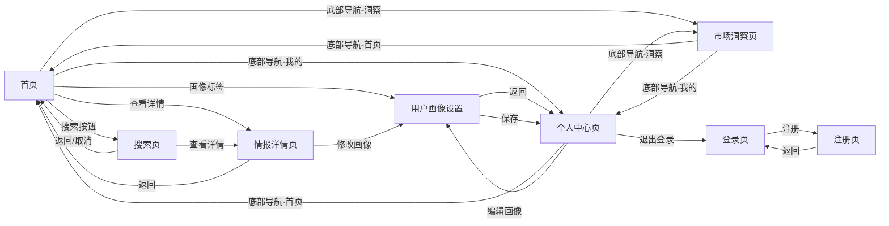
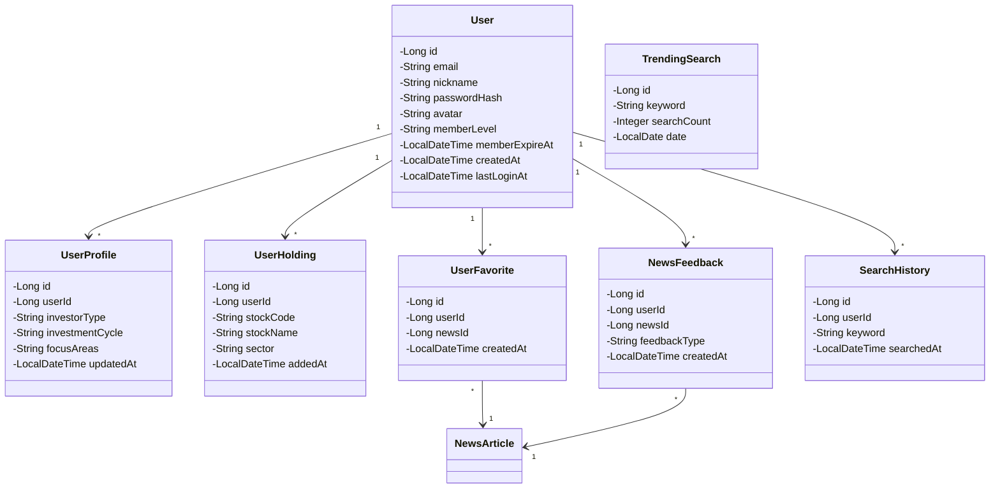
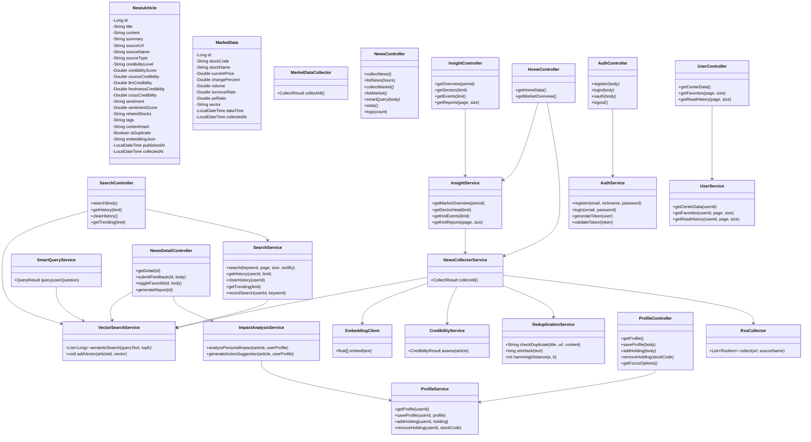

# 华尔街之眼 — AI 投研情报引擎 技术方案 V2

> 基于交互稿完善，覆盖全部页面模块的完整技术方案

---

## 1. 产品概述

聚焦 AI 与科技投资领域的智能情报引擎。从 10 个异构信息源自动采集新闻和行情数据，通过 LLM 结构化提取 + Embedding 向量化 + SimHash 去重 + 四维置信度评估，结合用户画像生成个性化投研分析。

技术栈：Spring Boot 3.4 + JDK 21 + Spring AI + H2 + 内存向量缓存

### 1.1 交互稿页面清单

| 页面 | 说明 | 对应后端模块 |
|------|------|-------------|
| 首页 | 问候栏+快速操作+市场概览+情报列表 | HomeController, NewsController |
| 情报详情页 | 全文+来源+个性化影响+操作建议+相关情报 | NewsDetailController |
| 市场洞察页 | 市场概览+行业热度+事件时间轴+研报 | InsightController |
| 搜索页 | 搜索框+历史+热门+结果列表 | SearchController |
| 用户画像设置页 | 投资者类型+周期+领域+持仓 | ProfileController |
| 个人中心页 | 用户信息+统计+会员+菜单 | UserController |
| 登录注册页 | 邮箱登录+注册+第三方OAuth | AuthController |
| 注册页 | 邮箱+昵称+密码+协议 | AuthController |

### 1.2 页面导航关系（基于交互稿交互数据）



---

## 2. 系统架构（V2 完整版）

```mermaid
graph TD
    subgraph 前端-移动端
        HOME[首页]
        DETAIL[情报详情页]
        INSIGHT[市场洞察页]
        SEARCH[搜索页]
        PROFILE[用户画像设置]
        ME[个人中心]
        AUTH[登录/注册]
    end
    subgraph API-Gateway
        HC[HomeController]
        NDC[NewsDetailController]
        IC[InsightController]
        SC[SearchController]
        PC[ProfileController]
        UC[UserController]
        AC[AuthController]
        NC[NewsController-已有]
    end
    subgraph Service
        NCS[NewsCollectorService-已有]
        SQS[SmartQueryService-已有]
        CS[CredibilityService-已有]
        DS[DeduplicationService-已有]
        SS[SearchService-新增]
        PS[ProfileService-新增]
        US[UserService-新增]
        AS[AuthService-新增]
        IS[InsightService-新增]
        IAS[ImpactAnalysisService-新增]
    end
    subgraph Collector-已有
        RSS[RssCollector]
        MDC[MarketDataCollector]
    end
    subgraph Embedding-已有
        EC[EmbeddingClient]
        VSS[VectorSearchService]
    end
    subgraph External
        RSSHUB[RSSHub 10个源]
        MAIRUI[麦蕊智数API]
        LLM[GPT-5.4 / Qwen3.5-flash]
        EMBAPI[Qwen-text-embedding-v4]
    end
    subgraph Storage
        H2[(H2 Database)]
        MEM[内存向量缓存]
    end

    HOME --> HC
    DETAIL --> NDC
    INSIGHT --> IC
    SEARCH --> SC
    PROFILE --> PC
    ME --> UC
    AUTH --> AC

    HC --> NCS
    HC --> IS
    NDC --> NCS
    NDC --> IAS
    NDC --> VSS
    IC --> IS
    IC --> NCS
    SC --> SS
    SC --> VSS
    PC --> PS
    UC --> US
    AC --> AS

    NCS --> RSS --> RSSHUB
    NCS --> DS
    NCS --> CS
    NCS --> EC
    NCS --> VSS
    NCS -->|GPT-5.4| LLM
    SQS --> VSS
    SQS -->|Qwen3.5-flash| LLM
    SS --> VSS
    IAS -->|Qwen3.5-flash| LLM
    EC --> EMBAPI
    VSS --> MEM
    MDC --> MAIRUI
    NCS --> H2
    MDC --> H2
    VSS --> H2
    PS --> H2
    US --> H2
    AS --> H2
    SS --> H2
    IS --> H2
```



---

## 3. 数据模型（V2 新增实体）

### 3.1 已有实体（保持不变）

- `NewsArticle` — 新闻文章（含置信度、情感、Embedding等20+字段）
- `MarketData` — 行情数据（股票代码、价格、涨跌幅等）

### 3.2 新增实体



---

## 4. 完整类图（V2）



---

## 5. 各模块详细设计

### 5.1 用户认证模块（AuthService）

对应页面：登录注册页、注册页

技术方案：
- JWT Token 认证，存储在 H2 的 `users` 表
- 密码使用 BCrypt 加密存储
- Token 有效期：普通登录 24h，记住我 7d
- 第三方登录预留 OAuth2 接口（微信/QQ/手机号）

数据表：
```sql
CREATE TABLE users (
    id BIGINT AUTO_INCREMENT PRIMARY KEY,
    email VARCHAR(255) UNIQUE NOT NULL,
    nickname VARCHAR(100) NOT NULL,
    password_hash VARCHAR(255) NOT NULL,
    avatar VARCHAR(500),
    member_level VARCHAR(20) DEFAULT 'free',
    member_expire_at TIMESTAMP,
    created_at TIMESTAMP DEFAULT CURRENT_TIMESTAMP,
    last_login_at TIMESTAMP
);
```

### 5.2 首页模块（HomeController）

对应页面：首页

组成部分：
1. 用户问候栏 — 昵称 + 画像标签 + 市场状态一句话
2. 快速操作区 — 4个操作入口（采集新闻、智能问答、行情数据、我的画像）
3. 市场概览卡片 — 情绪指数 + 涨跌比 + 趋势图
4. 情报列表 — 按时间倒序，每条含优先级/来源/摘要/影响分析/置信度

数据来源：
- 问候栏：`UserProfile` + `InsightService.getMarketOverview()`
- 市场概览：`MarketData` 聚合计算 + `NewsArticle` 情感统计
- 情报列表：`NewsArticle` 表，已有 `GET /api/news` 接口扩展

情绪指数计算逻辑：
```
sentimentIndex = (positiveCount / totalCount) * 100
```
基于最近24h新闻的 sentiment 字段统计。

### 5.3 情报详情模块（NewsDetailController + ImpactAnalysisService）

对应页面：情报详情页

这是交互稿中最复杂的页面，包含：

1. 文章头部 — 优先级标签 + 置信度 + 来源数 + 标题 + 时间 + 阅读时间 + 来源名
2. 信息来源列表 — 交叉验证的多个来源，每个含可信度标签 + 查看原文链接
3. 正文内容 — 结构化的段落 + 列表
4. 个性化影响分析（核心功能）：
   - 用户画像卡片（关注领域/投资风格/风险偏好）
   - 影响项列表（高/中/低影响 + 详细分析）
5. 操作建议 — LLM 生成的投资建议
6. 相关情报 — 语义相似的其他新闻

个性化影响分析流程：
```
用户请求详情 → 获取文章数据 → 获取用户画像
    → ImpactAnalysisService.analyzePersonalImpact(article, profile)
    → 调用 Qwen3.5-flash LLM，Prompt 包含：
        - 文章摘要和标签
        - 用户关注领域、持仓、投资风格
    → 返回结构化影响分析 JSON
```

信息来源列表获取逻辑：
```
通过 DeduplicationService.simHash() 查找标题汉明距离 ≤ 10 的文章
→ 按来源去重 → 返回不同来源的同一事件报道列表
```

### 5.4 市场洞察模块（InsightController + InsightService）

对应页面：市场洞察页

组成部分：
1. 市场概览（扩展版）— 3个数据项（情绪指数/涨跌比/成交量）+ 情绪趋势图
2. 行业热度榜 — 基于新闻标签聚合，按热度排序 Top5
3. 热门事件时间轴 — 按时间排列的重大事件，含影响标签
4. 热门研报 — 来自东方财富研报源的研报列表

行业热度计算逻辑：
```
1. 从最近24h的 NewsArticle.tags 字段提取所有标签
2. 按标签分组计数 → 得到每个行业/领域的新闻数
3. 结合 MarketData 中对应板块的涨跌幅
4. heatScore = newsCount * 0.6 + abs(changePercent) * 10 * 0.4
5. 按 heatScore 降序排列
```

热门事件提取逻辑：
```
1. 从最近24h新闻中，按 credibilityScore 降序取 Top 文章
2. 通过 SimHash 聚类同一事件的多篇报道
3. 每个事件簇取置信度最高的文章作为代表
4. 基于 sentiment 和 crossSourceCount 生成影响标签
```

### 5.5 搜索模块（SearchController + SearchService）

对应页面：搜索页

搜索流程：
```
用户输入关键词 → SearchService.search()
    → VectorSearchService.semanticSearch(keyword, 50) 语义检索
    → 同时做关键词模糊匹配（title LIKE %keyword%）
    → 合并去重，按 sortBy 排序
    → 分页返回
```

搜索历史：
- 存储在 `search_history` 表，按用户+时间
- 同一关键词只保留最新一条
- 最多保留 50 条

热门搜索：
- `trending_search` 表按天聚合
- 每次搜索 +1 计数
- 取当天 Top 5

### 5.6 用户画像模块（ProfileController + ProfileService）

对应页面：用户画像设置页

表单字段（对应交互稿）：

| 字段 | 选项 | 存储 |
|------|------|------|
| 投资者类型 | 保守型/均衡型/成长型 | user_profiles.investor_type |
| 投资周期 | 短线(<1月)/中线(1-6月)/长线(>6月) | user_profiles.investment_cycle |
| 关注领域 | AI/芯片/机器人/新能源车/... (多选) | user_profiles.focus_areas (逗号分隔) |
| 我的持仓 | 股票列表 (增删) | user_holdings 表 |

数据表：
```sql
CREATE TABLE user_profiles (
    id BIGINT AUTO_INCREMENT PRIMARY KEY,
    user_id BIGINT NOT NULL,
    investor_type VARCHAR(20),
    investment_cycle VARCHAR(20),
    focus_areas VARCHAR(500),
    updated_at TIMESTAMP DEFAULT CURRENT_TIMESTAMP,
    FOREIGN KEY (user_id) REFERENCES users(id)
);

CREATE TABLE user_holdings (
    id BIGINT AUTO_INCREMENT PRIMARY KEY,
    user_id BIGINT NOT NULL,
    stock_code VARCHAR(20) NOT NULL,
    stock_name VARCHAR(100),
    sector VARCHAR(50),
    added_at TIMESTAMP DEFAULT CURRENT_TIMESTAMP,
    FOREIGN KEY (user_id) REFERENCES users(id)
);
```

### 5.7 个人中心模块（UserController + UserService）

对应页面：个人中心页

组成部分：
1. 用户信息 — 头像 + 昵称 + 会员标签 + 编辑按钮
2. 数据统计 — 已读数/收藏数/报告数
3. 会员卡片 — 等级 + 进度条 + 权益说明
4. 功能菜单：
   - 投资画像设置 → 跳转画像设置页
   - 消息通知 → 通知列表
   - 数据导出 → 导出报告
   - 深色模式 → 主题切换
5. 设置菜单：
   - 账号安全
   - 帮助与反馈
   - 关于我们
6. 退出登录按钮

---

## 6. 新增文件清单

### 6.1 Controller 层
```
src/main/java/com/example/demo/controller/
├── NewsController.java          (已有，需扩展)
├── AuthController.java          (新增)
├── HomeController.java          (新增)
├── NewsDetailController.java    (新增)
├── InsightController.java       (新增)
├── SearchController.java        (新增)
├── ProfileController.java       (新增)
└── UserController.java          (新增)
```

### 6.2 Service 层
```
src/main/java/com/example/demo/service/
├── NewsCollectorService.java    (已有)
├── SmartQueryService.java       (已有)
├── CredibilityService.java      (已有)
├── DeduplicationService.java    (已有)
├── AuthService.java             (新增)
├── ProfileService.java          (新增)
├── SearchService.java           (新增)
├── InsightService.java          (新增)
├── ImpactAnalysisService.java   (新增)
└── UserService.java             (新增)
```

### 6.3 Model 层
```
src/main/java/com/example/demo/model/
├── NewsArticle.java             (已有)
├── MarketData.java              (已有)
├── User.java                    (新增)
├── UserProfile.java             (新增)
├── UserHolding.java             (新增)
├── UserFavorite.java            (新增)
├── NewsFeedback.java            (新增)
├── SearchHistory.java           (新增)
└── TrendingSearch.java          (新增)
```

### 6.4 Repository 层
```
src/main/java/com/example/demo/repository/
├── NewsArticleRepository.java   (已有)
├── MarketDataRepository.java    (已有)
├── UserRepository.java          (新增)
├── UserProfileRepository.java   (新增)
├── UserHoldingRepository.java   (新增)
├── UserFavoriteRepository.java  (新增)
├── NewsFeedbackRepository.java  (新增)
├── SearchHistoryRepository.java (新增)
└── TrendingSearchRepository.java(新增)
```

---

## 7. 定时任务（SchedulerConfig 扩展）

| 任务 | 频率 | 说明 | 状态 |
|------|------|------|------|
| 新闻采集 | 每15分钟 | 10个RSS源采集+去重+LLM提取+Embedding | ✅ 已有 |
| 行情采集 | 每5分钟 | 麦蕊智数API采集A股行情 | ✅ 已有 |
| 热门搜索统计 | 每小时 | 聚合搜索记录生成热门榜 | 🆕 新增 |
| 行业热度计算 | 每30分钟 | 基于新闻标签+行情数据计算热度 | 🆕 新增 |
| 热门事件聚类 | 每30分钟 | SimHash聚类同一事件的多篇报道 | 🆕 新增 |

---

## 8. 外部依赖

| 依赖 | 用途 | 模型/版本 | 状态 |
|------|------|----------|------|
| RSSHub | 10个新闻源采集 | rsshub.chn.moe | ✅ 已接入 |
| 麦蕊智数API | A股行情数据 | REST API | ✅ 已接入 |
| GPT-5.4 | 新闻结构化提取(LLM) | OpenAI兼容 | ✅ 已接入 |
| Qwen3.5-flash | 智能问答+影响分析(LLM) | OpenAI兼容 | ✅ 已接入 |
| Qwen-text-embedding-v4 | 文本向量化 | 1536维 | ✅ 已接入 |
| Spring Security | JWT认证 | 6.x | 🆕 需引入 |
| BCrypt | 密码加密 | Spring Security内置 | 🆕 需引入 |

---

## 9. 核心算法说明

### 9.1 四级去重（已实现）
1. URL精确匹配
2. SimHash标题指纹（汉明距离≤2）
3. 内容MD5哈希
4. SimHash内容指纹（汉明距离≤3）

### 9.2 四维置信度评估（已实现）
- 来源权威性 (30%) — 基于来源名称的预设分数
- LLM情感置信度 (25%) — sentimentScore 偏离0.5的程度
- 时效性 (20%) — 基于采集时间的衰减函数
- 交叉验证 (25%) — 同一事件被不同来源报道的数量

### 9.3 语义搜索（已实现）
- Embedding: Qwen-text-embedding-v4 (1536维)
- 相似度: 余弦相似度
- 存储: ConcurrentHashMap 内存缓存 + H2持久化

### 9.4 个性化影响分析（新增）
```
输入: NewsArticle + UserProfile
→ 构建 Prompt:
    "基于用户画像(投资者类型/关注领域/持仓)，
     分析这条新闻对用户的个性化影响，
     返回JSON格式的影响分析和操作建议"
→ 调用 Qwen3.5-flash
→ 解析返回的结构化 JSON
→ 缓存结果(同一用户+同一文章 1小时内不重复调用)
```
