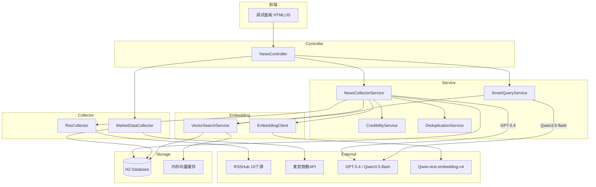
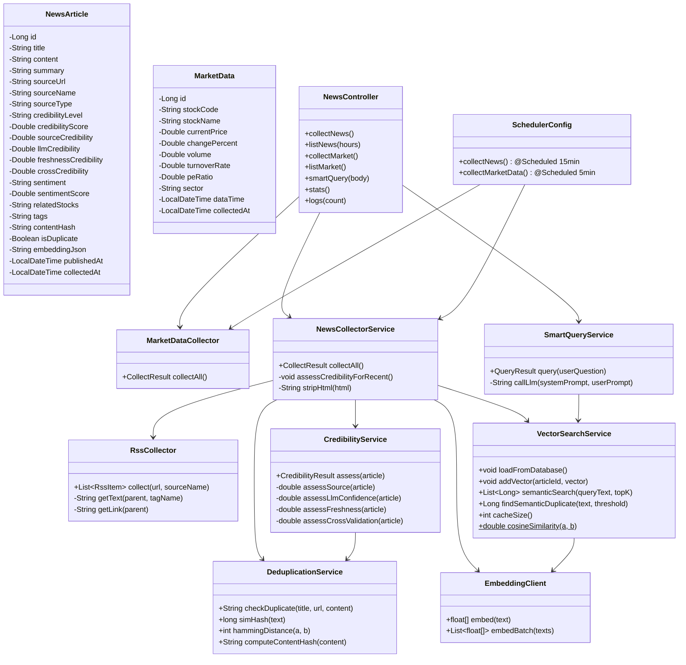

# 华尔街之眼 — AI 投研情报引擎 技术方案

## 1. 产品概述

聚焦 AI 与科技投资领域的智能情报引擎。从 10 个异构信息源自动采集新闻和行情数据，通过 LLM 结构化提取 + Embedding 向量化 + SimHash 去重 + 四维置信度评估，结合用户画像生成个性化投研分析。

技术栈：Spring Boot 3.4 + JDK 21 + Spring AI + H2 + 内存向量缓存

## 2. 系统架构

## 3. 类图

