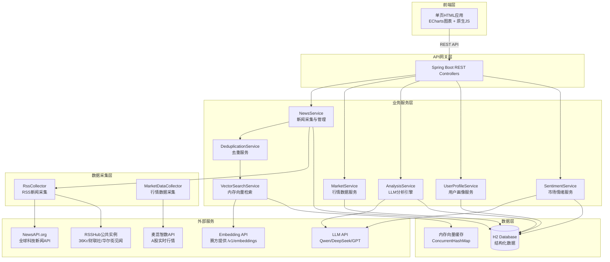
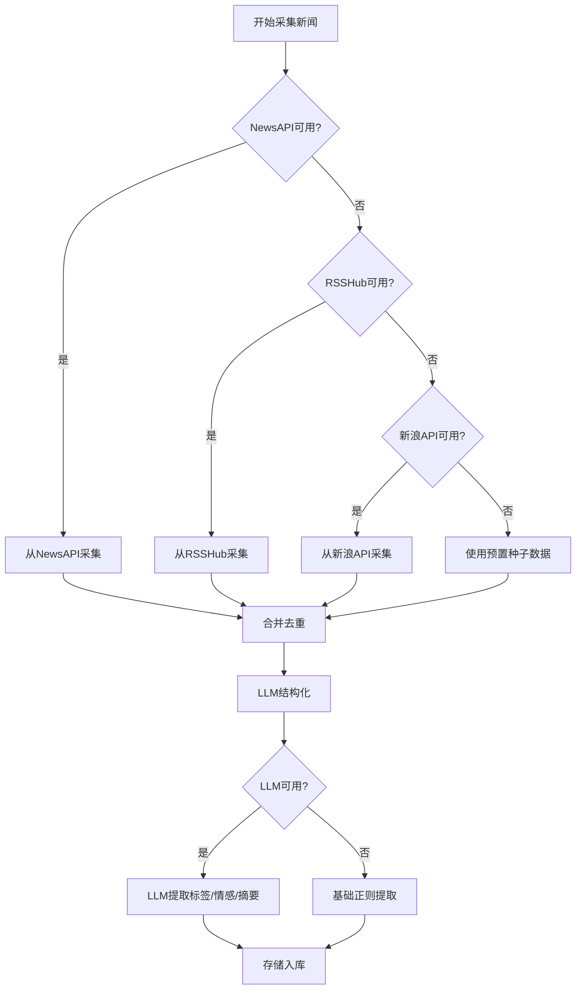
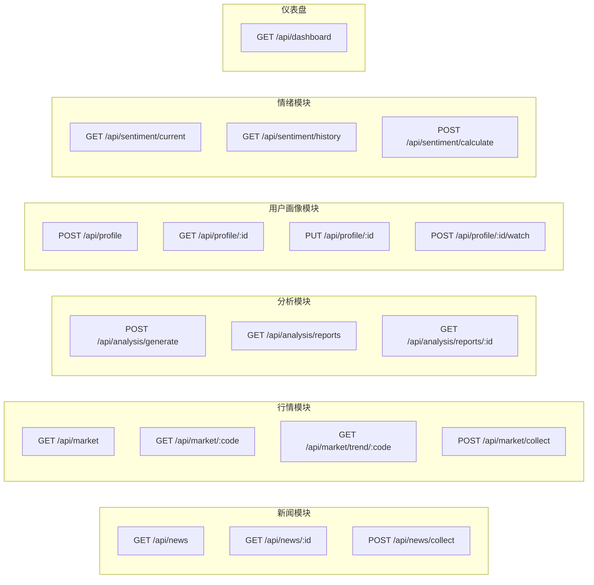
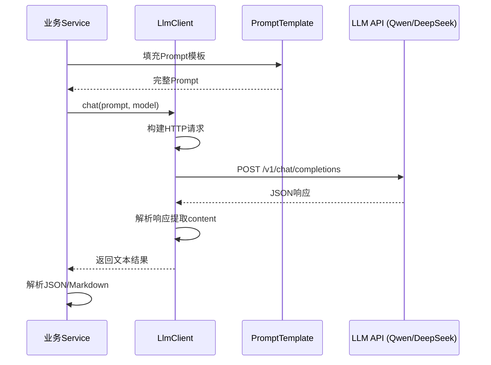
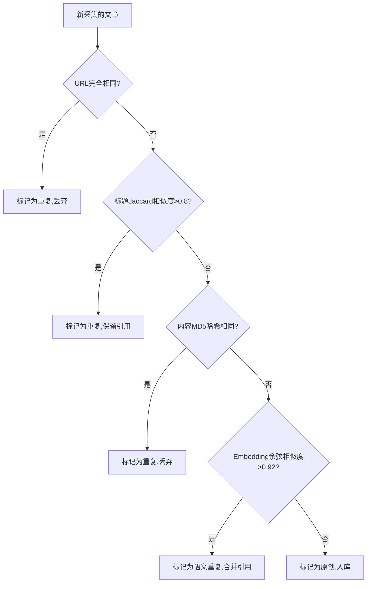
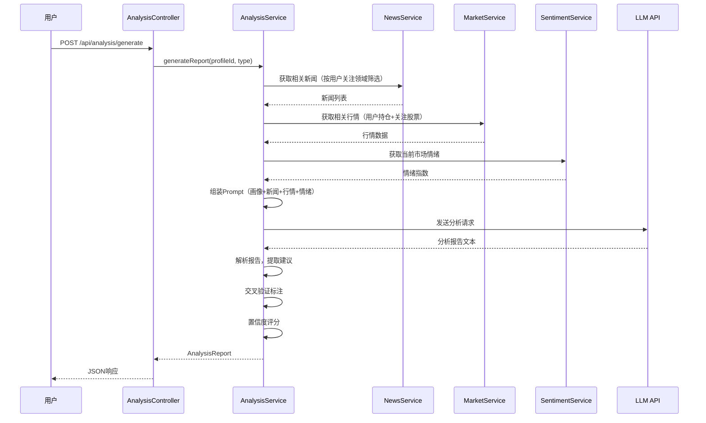
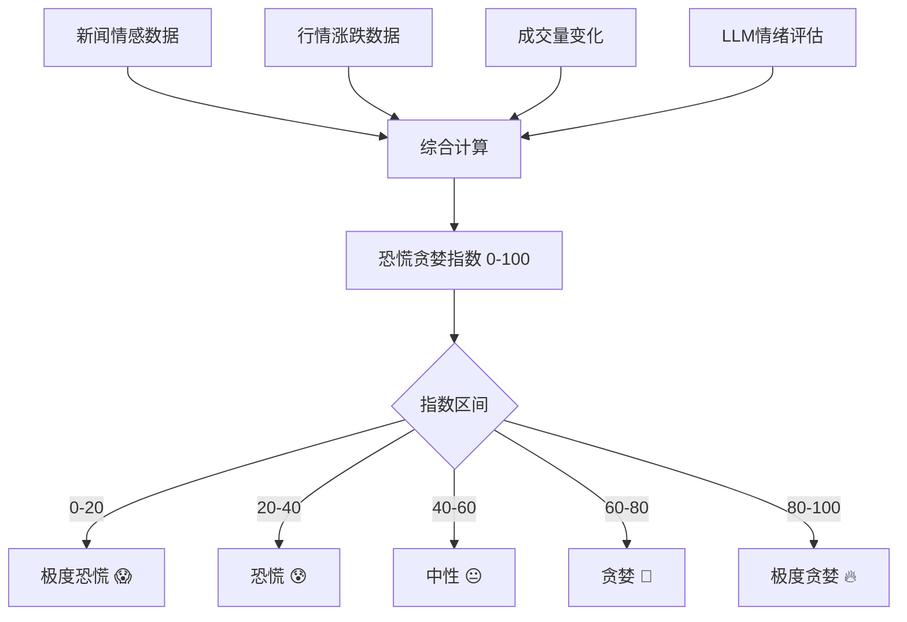

# 设计文档：华尔街之眼 — AI 投研情报引擎

## 1. 概述

华尔街之眼是一个聚焦 AI 与科技投资领域的智能情报引擎。系统从多个异构信息源（财经新闻 RSS/API、股票行情 API）自动采集数据，通过 LLM 进行结构化分析、去重、置信度评估和交叉验证，结合用户画像（关注领域、持仓、投资偏好）生成个性化的投研研判和操作建议。

系统基于现有 Spring Boot 2.7.18 + H2 + JPA + Java 8 项目扩展，保持单体架构，前端为单页 HTML 应用。

存储方案：H2 嵌入式数据库（结构化数据持久化）+ 内存向量缓存（Embedding 语义检索）。部署为单个 jar 包，零外部依赖，`java -jar` 直接运行。

核心亮点包括：多数据源交叉验证、Embedding 语义去重与智能检索、市场情绪面板（恐慌/贪婪指数）、趋势分析图表、信息溯源与置信度标注。

项目定位为两天内可完成的比赛作品，设计上优先保证核心功能闭环，避免过度工程化。

## 2. 系统架构

### 2.1 整体架构图



### 2.2 模块划分

| 模块 | 职责 | 包路径 |
|------|------|--------|
| collector | 数据采集（RSS、行情） | com.example.demo.collector |
| service | 业务逻辑（分析、去重、情绪） | com.example.demo.service |
| controller | REST API 接口 | com.example.demo.controller |
| model | JPA 实体 | com.example.demo.model |
| repository | 数据访问 | com.example.demo.repository |
| dto | 数据传输对象 | com.example.demo.dto |
| config | 配置类（LLM、定时任务） | com.example.demo.config |
| llm | LLM 客户端封装 | com.example.demo.llm |
| embedding | Embedding客户端 + 内存向量检索 | com.example.demo.embedding |

## 3. 数据采集方案

### 3.1 数据源总览

| 数据源 | 类型 | 免费 | 需注册 | 格式 | 推荐 |
|--------|------|------|--------|------|------|
| NewsAPI.org | 新闻API | 是(100次/天) | 是 | JSON | ⭐⭐⭐⭐⭐ |
| RSSHub公共实例 | RSS | 是 | 否 | XML | ⭐⭐⭐⭐ |
| 麦蕊智数 | 股票行情API | 是 | 是 | JSON | ⭐⭐⭐⭐⭐ |
| 东方财富 | 股票行情 | 是 | 否 | JSON | ⭐⭐⭐⭐ |

### 3.2 一条新闻从采集到入库的完整流程（核心）

一条新闻经过 7 个步骤完成入库，涉及两个外部 API（Embedding + LLM）：

```
① HTTP采集原始数据（NewsAPI / RSSHub）
       ↓
② 解析为原始 NewsArticle（只有标题、内容、来源URL）
       ↓
③ 四级去重检查（URL → 标题Jaccard → 内容MD5 → Embedding余弦）
       ↓ 通过
④ 调 Embedding API（/v1/embeddings）→ 生成 float[] 向量
       ↓
⑤ 调 LLM API（/v1/chat/completions）→ 提取摘要、标签、情感、置信度
       ↓
⑥ 组装完整 NewsArticle（结构化字段 + embeddingJson + 溯源信息）
       ↓
⑦ 存入 H2（一行记录）+ 内存向量缓存（一条向量）
```

Embedding 和 LLM 是两个不同的 API，做不同的事：
- Embedding（`/v1/embeddings`）：文本→数字向量，用于语义去重和相似检索，快
- LLM（`/v1/chat/completions`）：理解内容→提取标签/情感/摘要/置信度，慢

存储只有一个数据库（H2），向量额外在内存 Map 里存一份方便快速检索。

### 3.3 新闻数据源详情

#### 数据源A：NewsAPI.org（主力新闻源）

注册地址：https://newsapi.org/register （免费，开发阶段无需付费）

```
# 搜索AI科技领域新闻
GET https://newsapi.org/v2/everything?q=AI+芯片+科技+投资&language=zh&sortBy=publishedAt&pageSize=20&apiKey={YOUR_API_KEY}

# 响应格式（已验证）：
{
  "status": "ok",
  "totalResults": 150,
  "articles": [
    {
      "source": { "id": "...", "name": "新浪财经" },
      "author": "记者名",
      "title": "英伟达发布新一代AI芯片...",
      "description": "摘要文本...",
      "url": "https://原始链接",
      "urlToImage": "https://图片链接",
      "publishedAt": "2024-01-15T10:30:00Z",
      "content": "正文内容（截断至200字符）..."
    }
  ]
}
```

Java调用示例：
```java
// NewsAPI采集器核心代码
public List<NewsArticle> collectFromNewsApi(String apiKey) {
    String url = "https://newsapi.org/v2/everything"
        + "?q=AI+芯片+科技+投资+英伟达+大模型"
        + "&language=zh&sortBy=publishedAt&pageSize=20"
        + "&apiKey=" + apiKey;
    
    ResponseEntity<String> response = restTemplate.getForEntity(url, String.class);
    JsonNode root = objectMapper.readTree(response.getBody());
    JsonNode articles = root.get("articles");
    
    List<NewsArticle> result = new ArrayList<>();
    for (JsonNode item : articles) {
        NewsArticle article = new NewsArticle();
        article.setTitle(item.get("title").asText());
        article.setContent(item.has("content") ? item.get("content").asText() : item.get("description").asText());
        article.setSourceUrl(item.get("url").asText());
        article.setSourceName(item.get("source").get("name").asText());
        article.setSourceType("api");
        article.setPublishedAt(parseIsoDate(item.get("publishedAt").asText()));
        result.add(article);
    }
    return result;
}
```

> 免费版限制：100次请求/天，每次最多100条。比赛期间完全够用（每30分钟采集一次 = 48次/天）。

#### 数据源B：RSSHub公共实例（补充新闻源，无需注册）

RSSHub 是开源的 RSS 生成器，有大量公共实例可直接使用，无需注册：

```
# 36Kr 科技快讯（公共实例，直接GET）
GET https://rsshub.app/36kr/information/web_news

# 财联社深度报道
GET https://rsshub.app/cls/depth/1000

# 华尔街见闻快讯
GET https://rsshub.app/wallstreetcn/news/global

# 备用公共实例（如果rsshub.app不稳定）
GET https://rsshub.sksren.com/36kr/information/web_news
GET https://hub.slarker.me/36kr/information/web_news
```

返回标准 RSS/Atom XML 格式：
```xml
<feed>
  <entry>
    <title>OpenAI发布GPT-5...</title>
    <link href="https://36kr.com/p/xxxxx"/>
    <published>2024-01-15T10:00:00Z</published>
    <summary>摘要内容...</summary>
    <content>完整内容...</content>
  </entry>
</feed>
```

Java解析RSS的核心代码：
```java
// 使用JDK自带的XML解析器，无需额外依赖
public List<NewsArticle> collectFromRss(String rssUrl, String sourceName) {
    String xml = restTemplate.getForObject(rssUrl, String.class);
    
    DocumentBuilderFactory factory = DocumentBuilderFactory.newInstance();
    DocumentBuilder builder = factory.newDocumentBuilder();
    Document doc = builder.parse(new InputSource(new StringReader(xml)));
    
    // 兼容RSS 2.0和Atom格式
    NodeList items = doc.getElementsByTagName("item");  // RSS 2.0
    if (items.getLength() == 0) {
        items = doc.getElementsByTagName("entry");       // Atom
    }
    
    List<NewsArticle> result = new ArrayList<>();
    for (int i = 0; i < items.getLength(); i++) {
        Element item = (Element) items.item(i);
        NewsArticle article = new NewsArticle();
        article.setTitle(getTagContent(item, "title"));
        article.setContent(getTagContent(item, "description", "content", "summary"));
        article.setSourceUrl(getTagAttribute(item, "link", "href"));
        article.setSourceName(sourceName);
        article.setSourceType("rss");
        article.setPublishedAt(parseDate(getTagContent(item, "pubDate", "published")));
        result.add(article);
    }
    return result;
}
```

#### 数据源C（备选）：新浪财经科技频道 JSON API

```
# 新浪财经科技新闻（无需注册，直接GET）
GET https://feed.mix.sina.com.cn/api/roll/get?pageid=153&lid=2516&k=&num=30&page=1

# 响应格式：
{
  "result": {
    "status": { "code": 0 },
    "data": [
      {
        "title": "新闻标题",
        "url": "https://finance.sina.com.cn/...",
        "summary": "摘要",
        "ctime": "1705286400",  // Unix时间戳
        "media_name": "新浪财经"
      }
    ]
  }
}
```

> 注意：新浪API返回的是JSONP格式，需要去掉callback包装。如果不稳定，优先使用NewsAPI + RSSHub组合。

### 3.4 行情数据源详情

#### 数据源D：麦蕊智数 mairui.club（推荐，已验证可用）

注册地址：https://www.mairui.club/gratis.html （免费获取licence证书）

```
# 沪深两市股票列表
GET https://api.mairui.club/hslt/list/{licence}

# 实时交易数据（每分钟更新）
GET https://api.mairui.club/hsrl/ssjy/{股票代码}/{licence}

# 响应格式（已验证）：
{
  "p": 10.16,        // 当前价格（元）
  "pc": 0.30,        // 涨跌幅（%）
  "v": 1294059,      // 成交量（手）
  "cje": 1318858687, // 成交额（元）
  "h": 10.26,        // 最高价
  "l": 10.11,        // 最低价
  "o": 10.11,        // 开盘价
  "yc": 10.13,       // 昨收价
  "hs": 0.67,        // 换手率（%）
  "pe": 3.81,        // 市盈率
  "sjl": 0.48,       // 市净率
  "sz": 197164128892,// 总市值（元）
  "lt": 197161074084,// 流通市值（元）
  "zf": 1.48,        // 振幅（%）
  "t": "2024-08-30 15:29:03"  // 时间
}

# 历史分时数据（K线）
GET https://api.mairui.club/hszbl/fsjy/{股票代码}/60m/{licence}

# 买卖五档盘口
GET https://api.mairui.club/hsrl/mmwp/{股票代码}/{licence}
```

Java调用示例：
```java
// AI概念股代码列表（预配置）
private static final String[] AI_STOCKS = {
    "002230",  // 科大讯飞
    "300496",  // 中科创达
    "688111",  // 金山办公
    "300033",  // 同花顺
    "002415",  // 海康威视
    "603019",  // 中科曙光
    "688256",  // 寒武纪
    "688041",  // 海光信息
    "002049",  // 紫光国微
    "688396",  // 华润微
};

public List<MarketData> collectAiStocks(String licence) {
    List<MarketData> result = new ArrayList<>();
    for (String code : AI_STOCKS) {
        String url = "https://api.mairui.club/hsrl/ssjy/" + code + "/" + licence;
        try {
            String json = restTemplate.getForObject(url, String.class);
            JsonNode node = objectMapper.readTree(json);
            
            MarketData data = new MarketData();
            data.setStockCode(code);
            data.setCurrentPrice(node.get("p").asDouble());
            data.setChangePercent(node.get("pc").asDouble());
            data.setVolume(node.get("v").asDouble());
            data.setTurnoverRate(node.get("hs").asDouble());
            data.setPeRatio(node.get("pe").asDouble());
            data.setDataTime(parseDateTime(node.get("t").asText()));
            data.setCollectedAt(LocalDateTime.now());
            result.add(data);
            
            Thread.sleep(200); // 避免请求过快被限流
        } catch (Exception e) {
            log.warn("采集{}行情失败: {}", code, e.getMessage());
        }
    }
    return result;
}
```

#### 数据源E（备选）：东方财富公开接口

```
# AI概念板块行情（无需注册）
GET https://push2.eastmoney.com/api/qt/clist/get?pn=1&pz=20&po=1&np=1&fltt=2&invt=2&fid=f3&fs=b:BK0800&fields=f2,f3,f4,f12,f14

# 字段说明：
# f2=最新价, f3=涨跌幅, f4=涨跌额, f12=代码, f14=名称
# fs=b:BK0800 表示AI概念板块
```

### 3.5 采集策略与容错

```java
// 采集频率配置
public class CollectorConfig {
    // 新闻采集：每30分钟一次
    public static final long NEWS_INTERVAL_MS = 30 * 60 * 1000;
    // 行情采集：每5分钟一次（交易时段）
    public static final long MARKET_INTERVAL_MS = 5 * 60 * 1000;
    // 交易时段：9:30-11:30, 13:00-15:00
    public static final String TRADING_HOURS = "09:30-11:30,13:00-15:00";
    // 单次采集最大条数
    public static final int MAX_FETCH_SIZE = 50;
    // HTTP请求超时
    public static final int HTTP_TIMEOUT_MS = 15000;
}
```

#### 数据源容错策略



> 关键设计：每个数据源都有备选方案，确保比赛演示时即使某个源挂了也能正常运行。最坏情况下使用预置的种子数据（约50条精选AI科技新闻）保证系统可演示。

### 3.6 LLM 结构化提取详情（步骤⑤）

```java
// LLM结构化提取的Prompt模板
String EXTRACT_PROMPT = """
请分析以下财经新闻，提取结构化信息，以JSON格式返回：
{
  "summary": "一句话摘要（不超过100字）",
  "tags": ["标签1", "标签2"],
  "relatedStocks": ["股票代码1", "股票代码2"],
  "sentiment": "positive/negative/neutral",
  "sentimentScore": 0.0到1.0之间的数值,
  "keyEntities": ["公司/人物/产品名"],
  "investmentRelevance": "high/medium/low",
  "credibilityLevel": "authoritative/normal/questionable",
  "isFirstHand": true/false,
  "firstHandReason": "判断是一手信源还是二手转述的理由"
}

新闻标题：{title}
新闻内容：{content}
新闻来源：{source}
""";
```

#### 降级方案：基础正则提取（LLM不可用时）

```java
// 当LLM调用失败时的降级提取逻辑
public NewsArticle basicExtract(NewsArticle article) {
    String text = article.getTitle() + " " + article.getContent();
    
    // 基础标签提取：关键词匹配
    List<String> tags = new ArrayList<>();
    Map<String, String> KEYWORD_TAGS = Map.of(
        "AI|人工智能|大模型|GPT|LLM", "AI",
        "芯片|半导体|GPU|英伟达|NVIDIA", "芯片",
        "云计算|AWS|Azure|阿里云", "云计算",
        "机器人|自动驾驶|无人机", "机器人"
    );
    for (Map.Entry<String, String> entry : KEYWORD_TAGS.entrySet()) {
        if (Pattern.compile(entry.getKey()).matcher(text).find()) {
            tags.add(entry.getValue());
        }
    }
    
    // 基础情感判断：正负面关键词计数
    int positive = countMatches(text, "利好|上涨|突破|增长|创新|领先|超预期");
    int negative = countMatches(text, "利空|下跌|风险|亏损|制裁|下滑|低于预期");
    article.setSentiment(positive > negative ? "positive" : negative > positive ? "negative" : "neutral");
    article.setSentimentScore(positive > negative ? 0.7 : negative > positive ? 0.3 : 0.5);
    
    // 摘要：取前100字
    article.setSummary(text.length() > 100 ? text.substring(0, 100) + "..." : text);
    article.setRelatedStocks(String.join(",", tags));
    
    return article;
}
```

### 3.7 Embedding 向量化与内存检索详情（步骤④）

#### 为什么用 H2 + 内存而不是 MongoDB + Chroma

- 部署为单个 jar 包，零外部依赖，比赛演示稳定性最高
- 新闻量几百到几千条，内存完全 hold 住
- H2 已在项目中配好，无需额外安装

#### 内存向量检索服务

```java
/**
 * 内存向量检索服务
 * 使用 ConcurrentHashMap 存储 articleId → embedding 映射
 * 支持余弦相似度检索，用于语义去重和智能搜索
 */
@Service
public class VectorSearchService {

    // 内存向量缓存：articleId → embedding向量
    private final ConcurrentHashMap<Long, float[]> vectorCache = new ConcurrentHashMap<>();
    private final EmbeddingClient embeddingClient;

    /**
     * 对文本生成Embedding向量
     * 调用赛方 /v1/embeddings 接口
     */
    public float[] embed(String text);

    /**
     * 添加文章向量到缓存
     */
    public void addVector(Long articleId, float[] vector);

    /**
     * 语义相似度搜索：找到与query最相似的topK篇文章
     * @param queryText 查询文本
     * @param topK 返回数量
     * @return 按相似度降序排列的articleId列表
     *
     * 算法：
     * 1. 对queryText调用Embedding API生成向量
     * 2. 遍历vectorCache，计算余弦相似度
     * 3. 取topK个最高相似度的articleId
     */
    public List<Long> semanticSearch(String queryText, int topK);

    /**
     * 语义去重：检查新文章是否与已有文章语义重复
     * @param text 新文章标题+摘要
     * @param threshold 相似度阈值（建议0.92）
     * @return 如果存在相似度>threshold的文章，返回该文章ID；否则返回null
     */
    public Long findSemanticDuplicate(String text, double threshold);

    /**
     * 余弦相似度计算
     */
    public static double cosineSimilarity(float[] a, float[] b) {
        double dotProduct = 0, normA = 0, normB = 0;
        for (int i = 0; i < a.length; i++) {
            dotProduct += a[i] * b[i];
            normA += a[i] * a[i];
            normB += b[i] * b[i];
        }
        return dotProduct / (Math.sqrt(normA) * Math.sqrt(normB));
    }

    /**
     * 应用启动时从H2恢复向量缓存
     * NewsArticle表增加embeddingJson字段存储序列化的向量
     */
    @PostConstruct
    public void loadFromDatabase();
}
```

#### Embedding 用于三个场景

| 场景 | 用途 | 调用时机 |
|------|------|----------|
| 语义去重 | 比标题Jaccard更准确，能识别改写/转述的重复新闻 | 新闻入库前 |
| 智能检索 | 用户输入自然语言查询，语义匹配相关新闻 | 用户搜索时 |
| 新闻聚类 | 自动将语义相关的新闻归为同一事件（用于交叉验证） | 交叉验证时 |

#### EmbeddingClient 封装

```java
/**
 * Embedding API 客户端
 * 调用赛方提供的 /v1/embeddings 接口
 */
@Component
public class EmbeddingClient {

    private final RestTemplate restTemplate;
    private final String apiUrl;    // 赛方Embedding API地址
    private final String apiKey;
    private final String model;     // 如 text-embedding-v1

    /**
     * 对单条文本生成Embedding
     * POST /v1/embeddings
     * Request: { "model": "text-embedding-v1", "input": "文本内容" }
     * Response: { "data": [{ "embedding": [0.1, 0.2, ...] }] }
     */
    public float[] getEmbedding(String text) {
        Map<String, Object> request = new HashMap<>();
        request.put("model", model);
        request.put("input", text);

        ResponseEntity<String> response = restTemplate.postForEntity(apiUrl, request, String.class);
        JsonNode data = objectMapper.readTree(response.getBody())
            .get("data").get(0).get("embedding");

        float[] vector = new float[data.size()];
        for (int i = 0; i < data.size(); i++) {
            vector[i] = (float) data.get(i).asDouble();
        }
        return vector;
    }

    /**
     * 批量Embedding（减少API调用次数）
     */
    public List<float[]> getEmbeddings(List<String> texts);
}
```

#### 向量持久化策略

为了应用重启后不丢失向量缓存，在 NewsArticle 实体中增加 `embeddingJson` 字段：

```java
@Entity
@Table(name = "news_articles")
public class NewsArticle {
    // ... 其他字段 ...

    @Column(columnDefinition = "CLOB")
    private String embeddingJson;  // 向量序列化为JSON数组字符串，如 "[0.1,0.2,...]"
}
```

应用启动时 `@PostConstruct` 从 H2 加载所有文章的 embeddingJson，反序列化到内存 Map。这样即使重启也不需要重新调 Embedding API。

## 4. 数据模型设计

### 4.1 实体关系图

```mermaid
erDiagram
    UserProfile ||--o{ WatchItem : has
    UserProfile ||--o{ AnalysisReport : receives
    NewsArticle ||--o{ AnalysisReport : referenced_in
    MarketData ||--o{ AnalysisReport : referenced_in
    NewsArticle ||--o{ NewsTag : has

    UserProfile {
        Long id PK
        String nickname
        String focusAreas
        String holdings
        String riskPreference
        String investmentStyle
        LocalDateTime createdAt
        LocalDateTime updatedAt
    }

    WatchItem {
        Long id PK
        Long userProfileId FK
        String stockCode
        String stockName
        String reason
        LocalDateTime createdAt
    }

    NewsArticle {
        Long id PK
        String title
        String content
        String summary
        String sourceUrl
        String sourceName
        String sourceType
        String credibilityLevel
        String sentiment
        Double sentimentScore
        String relatedStocks
        String contentHash
        Boolean isDuplicate
        LocalDateTime publishedAt
        LocalDateTime collectedAt
    }

    NewsTag {
        Long id PK
        Long articleId FK
        String tag
    }

    MarketData {
        Long id PK
        String stockCode
        String stockName
        Double currentPrice
        Double changePercent
        Double volume
        Double turnoverRate
        Double peRatio
        String sector
        LocalDateTime dataTime
        LocalDateTime collectedAt
    }

    AnalysisReport {
        Long id PK
        Long userProfileId FK
        String reportType
        String content
        String recommendations
        String referencedArticleIds
        String referencedStockCodes
        Double confidenceScore
        String crossValidationResult
        LocalDateTime createdAt
    }

    SentimentIndex {
        Long id PK
        Double fearGreedIndex
        String marketMood
        Integer newsPositiveCount
        Integer newsNegativeCount
        Integer newsNeutralCount
        Double avgSentimentScore
        String topKeywords
        LocalDateTime calculatedAt
    }
}
```

### 4.2 实体详细定义


```java
// ==================== UserProfile 用户画像 ====================
@Entity
@Table(name = "user_profiles")
public class UserProfile {
    @Id
    @GeneratedValue(strategy = GenerationType.IDENTITY)
    private Long id;

    private String nickname;                    // 昵称

    @Column(length = 500)
    private String focusAreas;                  // 关注领域，逗号分隔：AI,芯片,新能源

    @Column(length = 500)
    private String holdings;                    // 持仓，逗号分隔：AAPL,NVDA,600519

    private String riskPreference;              // 风险偏好：conservative/moderate/aggressive

    private String investmentStyle;             // 投资风格：value/growth/trend/swing

    private LocalDateTime createdAt;
    private LocalDateTime updatedAt;
}

// ==================== NewsArticle 新闻文章 ====================
@Entity
@Table(name = "news_articles")
public class NewsArticle {
    @Id
    @GeneratedValue(strategy = GenerationType.IDENTITY)
    private Long id;

    @Column(length = 500)
    private String title;                       // 标题

    @Column(columnDefinition = "CLOB")
    private String content;                     // 原文内容

    @Column(length = 500)
    private String summary;                     // LLM生成的摘要

    @Column(length = 1000)
    private String sourceUrl;                   // 原始链接（信息溯源）

    private String sourceName;                  // 来源名称：新浪财经/36Kr/东方财富

    private String sourceType;                  // 来源类型：rss/api/web

    private String credibilityLevel;            // 可信度：authoritative/normal/questionable

    private String sentiment;                   // 情感：positive/negative/neutral

    private Double sentimentScore;              // 情感分数 0.0-1.0

    @Column(length = 500)
    private String relatedStocks;               // 关联股票代码，逗号分隔

    private String contentHash;                 // 内容哈希（用于去重）

    private Boolean isDuplicate;                // 是否重复

    @Column(columnDefinition = "CLOB")
    private String embeddingJson;               // Embedding向量JSON序列化，如"[0.1,0.2,...]"

    private LocalDateTime publishedAt;          // 发布时间
    private LocalDateTime collectedAt;          // 采集时间
}

// ==================== MarketData 行情数据 ====================
@Entity
@Table(name = "market_data")
public class MarketData {
    @Id
    @GeneratedValue(strategy = GenerationType.IDENTITY)
    private Long id;

    private String stockCode;                   // 股票代码
    private String stockName;                   // 股票名称
    private Double currentPrice;                // 当前价格
    private Double changePercent;               // 涨跌幅(%)
    private Double volume;                      // 成交量（手）
    private Double turnoverRate;                // 换手率(%)
    private Double peRatio;                     // 市盈率
    private String sector;                      // 所属板块

    private LocalDateTime dataTime;             // 数据时间
    private LocalDateTime collectedAt;          // 采集时间
}

// ==================== AnalysisReport 分析报告 ====================
@Entity
@Table(name = "analysis_reports")
public class AnalysisReport {
    @Id
    @GeneratedValue(strategy = GenerationType.IDENTITY)
    private Long id;

    private Long userProfileId;                 // 关联用户画像

    private String reportType;                  // 报告类型：daily_brief/stock_analysis/trend_alert

    @Column(columnDefinition = "CLOB")
    private String content;                     // 报告正文（Markdown格式）

    @Column(columnDefinition = "CLOB")
    private String recommendations;             // 操作建议JSON

    @Column(length = 500)
    private String referencedArticleIds;        // 引用的新闻ID，逗号分隔

    @Column(length = 500)
    private String referencedStockCodes;        // 引用的股票代码

    private Double confidenceScore;             // 置信度 0.0-1.0

    @Column(length = 1000)
    private String crossValidationResult;       // 交叉验证结果

    private LocalDateTime createdAt;
}

// ==================== SentimentIndex 市场情绪指数 ====================
@Entity
@Table(name = "sentiment_index")
public class SentimentIndex {
    @Id
    @GeneratedValue(strategy = GenerationType.IDENTITY)
    private Long id;

    private Double fearGreedIndex;              // 恐慌贪婪指数 0-100
    private String marketMood;                  // 市场情绪：extreme_fear/fear/neutral/greed/extreme_greed

    private Integer newsPositiveCount;          // 正面新闻数
    private Integer newsNegativeCount;          // 负面新闻数
    private Integer newsNeutralCount;           // 中性新闻数
    private Double avgSentimentScore;           // 平均情感分数

    @Column(length = 500)
    private String topKeywords;                 // 热门关键词JSON

    private LocalDateTime calculatedAt;         // 计算时间
}
```

## 5. API 接口设计

### 5.1 接口总览



### 5.2 接口详细定义


#### 5.2.1 新闻模块

```
GET /api/news?page=0&size=20&tag=AI&sentiment=positive&credibility=authoritative
Response: {
  "content": [
    {
      "id": 1,
      "title": "英伟达发布新一代AI芯片",
      "summary": "英伟达在GTC大会上发布...",
      "sourceName": "新浪财经",
      "sourceUrl": "https://finance.sina.com.cn/...",
      "credibilityLevel": "authoritative",
      "sentiment": "positive",
      "sentimentScore": 0.85,
      "relatedStocks": ["NVDA", "AMD"],
      "publishedAt": "2024-01-15T10:30:00"
    }
  ],
  "totalElements": 150,
  "totalPages": 8
}

GET /api/news/{id}
Response: { ...完整文章信息含原文content... }

POST /api/news/collect
Description: 手动触发新闻采集
Response: { "collected": 15, "deduplicated": 3, "stored": 12 }
```

#### 5.2.2 行情模块

```
GET /api/market?sector=AI概念&sortBy=changePercent&order=desc
Response: [
  {
    "stockCode": "002230",
    "stockName": "科大讯飞",
    "currentPrice": 58.32,
    "changePercent": 5.67,
    "volume": 1234567,
    "turnoverRate": 3.45,
    "peRatio": 89.2,
    "sector": "AI概念",
    "dataTime": "2024-01-15T15:00:00"
  }
]

GET /api/market/{code}
Response: { ...单只股票详细行情... }

GET /api/market/trend/{code}?days=30
Response: {
  "stockCode": "002230",
  "stockName": "科大讯飞",
  "trendData": [
    { "date": "2024-01-01", "close": 55.0, "volume": 100000 },
    { "date": "2024-01-02", "close": 56.5, "volume": 120000 }
  ]
}

POST /api/market/collect
Description: 手动触发行情采集
Response: { "collected": 20, "updated": 18 }
```

#### 5.2.3 分析模块

```
POST /api/analysis/generate
Request: {
  "userProfileId": 1,
  "reportType": "daily_brief",  // daily_brief | stock_analysis | trend_alert
  "focusStockCodes": ["NVDA", "002230"],  // 可选，指定分析的股票
  "timeRange": "24h"  // 分析的时间范围
}
Response: {
  "id": 10,
  "reportType": "daily_brief",
  "content": "## 今日AI科技投研简报\n\n### 核心要点\n...",
  "recommendations": [
    {
      "stockCode": "NVDA",
      "action": "关注",
      "reason": "新品发布利好，但估值偏高",
      "confidence": 0.75,
      "sources": ["新浪财经(权威)", "36Kr(一般)"]
    }
  ],
  "confidenceScore": 0.78,
  "crossValidation": {
    "consistentSources": 3,
    "conflictingSources": 1,
    "overallConsistency": "high"
  },
  "createdAt": "2024-01-15T16:00:00"
}

GET /api/analysis/reports?userProfileId=1&type=daily_brief&page=0&size=10
Response: { "content": [...], "totalElements": 25 }

GET /api/analysis/reports/{id}
Response: { ...完整报告... }
```

#### 5.2.4 用户画像模块

```
POST /api/profile
Request: {
  "nickname": "投资者A",
  "focusAreas": "AI,芯片,云计算",
  "holdings": "NVDA,AAPL,002230",
  "riskPreference": "moderate",
  "investmentStyle": "growth"
}
Response: { "id": 1, ...完整画像... }

GET /api/profile/{id}
Response: { ...用户画像详情... }

PUT /api/profile/{id}
Request: { ...更新字段... }
Response: { ...更新后画像... }

POST /api/profile/{id}/watch
Request: { "stockCode": "002230", "stockName": "科大讯飞", "reason": "AI龙头" }
Response: { "id": 1, ...关注项... }

GET /api/profile/{id}/watch
Response: [ ...关注列表... ]
```

#### 5.2.5 情绪模块

```
GET /api/sentiment/current
Response: {
  "fearGreedIndex": 65.5,
  "marketMood": "greed",
  "moodLabel": "贪婪",
  "newsPositiveCount": 45,
  "newsNegativeCount": 12,
  "newsNeutralCount": 23,
  "avgSentimentScore": 0.68,
  "topKeywords": ["AI", "英伟达", "大模型", "芯片", "算力"],
  "calculatedAt": "2024-01-15T16:00:00"
}

GET /api/sentiment/history?days=30
Response: [
  { "date": "2024-01-01", "fearGreedIndex": 55.0, "marketMood": "neutral" },
  { "date": "2024-01-02", "fearGreedIndex": 60.2, "marketMood": "greed" }
]

POST /api/sentiment/calculate
Description: 手动触发情绪计算
Response: { ...最新情绪指数... }
```

#### 5.2.6 仪表盘聚合接口

```
GET /api/dashboard
Response: {
  "sentiment": { ...当前情绪指数... },
  "latestNews": [ ...最新5条新闻摘要... ],
  "topMovers": [ ...涨跌幅前5的AI概念股... ],
  "recentReport": { ...最近一份分析报告摘要... },
  "stats": {
    "totalNews": 500,
    "todayNews": 35,
    "trackedStocks": 20,
    "reportsGenerated": 15
  }
}
```

## 6. LLM 集成方案

### 6.1 LLM 客户端架构



### 6.2 LLM 客户端封装

```java
/**
 * 统一LLM客户端，兼容OpenAI协议（Qwen/DeepSeek/GPT均兼容）
 */
public class LlmClient {
    private final RestTemplate restTemplate;
    private final String apiUrl;      // 赛方提供的API地址
    private final String apiKey;      // 赛方提供的API Key
    private final String modelName;   // 模型名称

    /**
     * 发送聊天请求
     * @param systemPrompt 系统提示词
     * @param userMessage 用户消息
     * @return LLM返回的文本
     */
    public String chat(String systemPrompt, String userMessage);

    /**
     * 发送聊天请求并解析为JSON
     * @param systemPrompt 系统提示词
     * @param userMessage 用户消息
     * @param responseClass 响应类型
     * @return 解析后的对象
     */
    public <T> T chatAsJson(String systemPrompt, String userMessage, Class<T> responseClass);
}
```

### 6.3 Prompt 设计

#### Prompt 1：新闻结构化提取

```java
public static final String NEWS_EXTRACT_SYSTEM = 
    "你是一个专业的AI科技领域财经分析师。你的任务是分析财经新闻并提取结构化信息。" +
    "请严格按照JSON格式返回，不要添加任何额外文字。";

public static final String NEWS_EXTRACT_USER = 
    "请分析以下财经新闻，提取结构化信息：\n\n" +
    "标题：{title}\n" +
    "来源：{source}\n" +
    "内容：{content}\n\n" +
    "请返回JSON格式：\n" +
    "{\n" +
    "  \"summary\": \"一句话摘要（不超过100字）\",\n" +
    "  \"tags\": [\"标签1\", \"标签2\"],\n" +
    "  \"relatedStocks\": [\"股票代码\"],\n" +
    "  \"sentiment\": \"positive/negative/neutral\",\n" +
    "  \"sentimentScore\": 0.0到1.0,\n" +
    "  \"keyEntities\": [\"实体名\"],\n" +
    "  \"investmentRelevance\": \"high/medium/low\",\n" +
    "  \"credibilityAssessment\": \"对来源可信度的评估\"\n" +
    "}";
```

#### Prompt 2：个性化投研报告生成

```java
public static final String REPORT_SYSTEM = 
    "你是「华尔街之眼」AI投研助手，专注AI与科技投资领域。" +
    "你需要基于用户画像和最新市场数据，生成个性化的投研报告。" +
    "报告要求：1)标注信息来源及可信度 2)给出置信度评分 3)区分事实与观点 4)给出具体操作建议";

public static final String REPORT_USER = 
    "## 用户画像\n" +
    "- 关注领域：{focusAreas}\n" +
    "- 当前持仓：{holdings}\n" +
    "- 风险偏好：{riskPreference}\n" +
    "- 投资风格：{investmentStyle}\n\n" +
    "## 最新新闻（{newsCount}条）\n{newsDigest}\n\n" +
    "## 相关行情数据\n{marketData}\n\n" +
    "## 市场情绪\n恐慌贪婪指数：{fearGreedIndex}（{marketMood}）\n\n" +
    "请生成个性化投研报告，包含：\n" +
    "1. **核心要点**（3-5条，每条标注来源和可信度）\n" +
    "2. **持仓分析**（针对用户持仓的具体分析）\n" +
    "3. **机会与风险**（基于用户风险偏好调整建议力度）\n" +
    "4. **操作建议**（具体到个股，标注置信度）\n" +
    "5. **交叉验证**（多源信息是否一致）\n\n" +
    "每条关键信息请标注：[来源名称|可信度:权威/一般/存疑]";
```

#### Prompt 3：市场情绪计算

```java
public static final String SENTIMENT_SYSTEM = 
    "你是市场情绪分析专家。根据提供的新闻数据，计算市场恐慌贪婪指数。";

public static final String SENTIMENT_USER = 
    "以下是最近24小时的AI科技领域新闻情感统计：\n" +
    "- 正面新闻：{positiveCount}条（占比{positiveRatio}%）\n" +
    "- 负面新闻：{negativeCount}条（占比{negativeRatio}%）\n" +
    "- 中性新闻：{neutralCount}条\n" +
    "- 平均情感分数：{avgScore}\n\n" +
    "热门关键词：{keywords}\n\n" +
    "AI概念股整体涨跌：{marketTrend}\n\n" +
    "请返回JSON：\n" +
    "{\n" +
    "  \"fearGreedIndex\": 0到100的数值（0=极度恐慌，100=极度贪婪）,\n" +
    "  \"marketMood\": \"extreme_fear/fear/neutral/greed/extreme_greed\",\n" +
    "  \"analysis\": \"一段分析说明\",\n" +
    "  \"topFactors\": [\"影响因素1\", \"影响因素2\"]\n" +
    "}";
```

### 6.4 LLM 调用策略

| 场景 | 调用时机 | 模型选择 | 超时 | 降级策略 |
|------|----------|----------|------|----------|
| 新闻结构化 | 采集后立即 | Qwen（快） | 30s | 使用基础正则提取 |
| 报告生成 | 用户请求时 | DeepSeek（强） | 60s | 返回原始数据摘要 |
| 情绪计算 | 定时/手动 | Qwen（快） | 30s | 使用统计公式计算 |
| 交叉验证 | 报告生成时 | Qwen（快） | 30s | 跳过验证标注 |

## 7. 内容质量控制方案

### 7.1 去重机制（四级去重，含语义去重）



```java
/**
 * 去重服务 - 四级去重策略（含Embedding语义去重）
 */
public class DeduplicationService {

    private final NewsArticleRepository newsArticleRepository;
    private final VectorSearchService vectorSearchService;

    /**
     * 检查文章是否重复
     * Level 1: URL精确匹配
     * Level 2: 标题Jaccard相似度（阈值0.8）
     * Level 3: 内容MD5哈希
     * Level 4: Embedding余弦相似度（阈值0.92）— 能识别改写/转述的重复
     */
    public DeduplicationResult checkDuplicate(String title, String url, String content);

    /**
     * 计算标题相似度（Jaccard）
     */
    public double calculateTitleSimilarity(String title1, String title2);

    /**
     * 计算内容哈希
     */
    public String computeContentHash(String content);
}
```

### 7.2 信息溯源

每条信息必须标注：
- `sourceUrl`：原始链接，用户可点击跳转验证
- `sourceName`：来源名称（新浪财经、36Kr、东方财富等）
- `sourceType`：来源类型（rss/api/web）
- `collectedAt`：采集时间

### 7.3 置信度评估

```java
/**
 * 置信度评估规则
 */
public class CredibilityAssessor {
    // 来源可信度基础分
    private static final Map<String, String> SOURCE_CREDIBILITY = Map.of(
        "新浪财经", "authoritative",    // 权威
        "东方财富", "authoritative",    // 权威
        "36Kr", "normal",              // 一般
        "自媒体", "questionable"       // 存疑
    );

    /**
     * 评估单条新闻的置信度
     * 综合考虑：来源权威性 + LLM评估 + 交叉验证
     */
    public CredibilityResult assess(NewsArticle article, List<NewsArticle> relatedArticles);
}
```

### 7.4 交叉验证

```java
/**
 * 多数据源交叉验证
 * 同一事件如果被多个独立来源报道，置信度提升
 */
public class CrossValidator {
    /**
     * 对一组相关新闻进行交叉验证
     * @param articles 同一话题的多篇文章
     * @return 验证结果：一致性评分 + 冲突点
     */
    public CrossValidationResult validate(List<NewsArticle> articles);
}
```

## 8. 用户画像方案

### 8.1 画像维度

| 维度 | 字段 | 取值范围 | 说明 |
|------|------|----------|------|
| 关注领域 | focusAreas | AI,芯片,云计算,新能源,机器人... | 逗号分隔，影响新闻筛选 |
| 持仓 | holdings | 股票代码列表 | 影响个股分析权重 |
| 风险偏好 | riskPreference | conservative/moderate/aggressive | 影响建议激进程度 |
| 投资风格 | investmentStyle | value/growth/trend/swing | 影响分析角度 |

### 8.2 画像影响分析输出

```java
/**
 * 根据用户画像调整分析策略
 */
public class ProfileBasedStrategy {
    /**
     * 根据风险偏好调整建议
     * conservative: 偏向防守，强调风险提示，建议仓位较轻
     * moderate: 平衡攻守，给出中性建议
     * aggressive: 偏向进攻，强调机会，建议仓位较重
     */
    public String adjustRecommendation(String baseRecommendation, String riskPreference);

    /**
     * 根据关注领域筛选相关新闻
     */
    public List<NewsArticle> filterByFocusAreas(List<NewsArticle> allNews, String focusAreas);

    /**
     * 根据持仓生成持仓相关分析
     */
    public String generateHoldingsAnalysis(String holdings, List<MarketData> marketData);
}
```

## 9. 个性化研判生成方案

### 9.1 研判生成流程



### 9.2 差异化输出示例

对于同一市场事件"英伟达发布新芯片"：

- 保守型投资者：「英伟达新品发布短期利好已部分消化，建议观望等待回调再考虑建仓，注意控制仓位在10%以内。[新浪财经|权威] 置信度:0.72」
- 激进型投资者：「英伟达新品性能超预期，AI算力需求持续增长，建议逢低加仓，目标仓位可达20%。[新浪财经|权威][36Kr|一般] 置信度:0.72」

## 10. 趋势分析和图表方案

### 10.1 图表类型

使用 ECharts（CDN引入）实现以下图表：

| 图表 | 类型 | 数据维度 | 用途 |
|------|------|----------|------|
| AI概念股涨跌排行 | 柱状图 | 股票涨跌幅 | 快速了解板块热度 |
| 恐慌贪婪指数趋势 | 折线图 | 时间×指数值 | 情绪变化趋势 |
| 新闻情感分布 | 饼图 | 正面/负面/中性占比 | 舆情概览 |
| 个股价格趋势 | K线/折线图 | 时间×价格 | 个股走势分析 |
| 热门关键词云 | 词云图 | 关键词×频次 | 市场热点一览 |

### 10.2 趋势数据接口

```java
// 趋势数据DTO
public class TrendDataDTO {
    private String stockCode;
    private String stockName;
    private List<DailyData> trendData;

    public static class DailyData {
        private String date;
        private Double close;      // 收盘价
        private Double volume;     // 成交量
        private Double changePercent; // 涨跌幅
    }
}

// 情绪趋势DTO
public class SentimentTrendDTO {
    private List<DailySentiment> data;

    public static class DailySentiment {
        private String date;
        private Double fearGreedIndex;
        private String marketMood;
    }
}
```

## 11. 市场情绪面板方案

### 11.1 恐慌贪婪指数计算



### 11.2 指数计算公式

```java
/**
 * 恐慌贪婪指数计算
 * 综合四个维度，加权平均
 */
public class FearGreedCalculator {
    // 权重配置
    private static final double W_NEWS_SENTIMENT = 0.35;  // 新闻情感权重
    private static final double W_MARKET_TREND = 0.30;    // 行情趋势权重
    private static final double W_VOLUME_CHANGE = 0.15;   // 成交量变化权重
    private static final double W_LLM_ASSESSMENT = 0.20;  // LLM综合评估权重

    /**
     * 计算恐慌贪婪指数
     * @param newsSentimentScore 新闻情感均分 (0-1)
     * @param marketTrendScore 行情趋势分 (0-1)，基于涨跌家数比
     * @param volumeChangeScore 成交量变化分 (0-1)，放量为贪婪
     * @param llmAssessmentScore LLM综合评估分 (0-1)
     * @return 恐慌贪婪指数 0-100
     */
    public double calculate(double newsSentimentScore, double marketTrendScore,
                           double volumeChangeScore, double llmAssessmentScore) {
        double index = (newsSentimentScore * W_NEWS_SENTIMENT
                     + marketTrendScore * W_MARKET_TREND
                     + volumeChangeScore * W_VOLUME_CHANGE
                     + llmAssessmentScore * W_LLM_ASSESSMENT) * 100;
        return Math.max(0, Math.min(100, index));
    }

    /**
     * 根据指数值判断市场情绪
     */
    public String getMood(double index) {
        if (index < 20) return "extreme_fear";
        if (index < 40) return "fear";
        if (index < 60) return "neutral";
        if (index < 80) return "greed";
        return "extreme_greed";
    }
}
```

### 11.3 情绪面板UI组件

面板展示内容：
- 仪表盘式恐慌贪婪指数（ECharts gauge）
- 情绪文字描述 + emoji
- 正面/负面/中性新闻数量统计
- 热门关键词标签云
- 近30天情绪趋势折线图

## 12. 前端页面设计

### 12.1 页面布局

单页应用，使用 Tab 切换不同功能区：

```
┌─────────────────────────────────────────────────────┐
│  🏛️ 华尔街之眼 — AI投研情报引擎                      │
│  [仪表盘] [新闻情报] [行情数据] [AI研判] [我的画像]    │
├─────────────────────────────────────────────────────┤
│                                                     │
│  ┌──────────────┐  ┌──────────────────────────────┐ │
│  │ 恐慌贪婪指数  │  │  最新AI科技新闻              │ │
│  │   🔥 72      │  │  ● 英伟达发布... [权威]      │ │
│  │   贪婪        │  │  ● 苹果AI战略... [一般]      │ │
│  │  ┌────────┐  │  │  ● 大模型降价... [权威]      │ │
│  │  │ gauge  │  │  │                              │ │
│  │  └────────┘  │  └──────────────────────────────┘ │
│  └──────────────┘                                   │
│                                                     │
│  ┌──────────────────────────────────────────────────┐│
│  │  AI概念股涨跌排行                                ││
│  │  ┌──────────────────────────────────────────┐   ││
│  │  │          ECharts 柱状图                   │   ││
│  │  └──────────────────────────────────────────┘   ││
│  └──────────────────────────────────────────────────┘│
│                                                     │
│  ┌──────────────────────────────────────────────────┐│
│  │  情绪趋势（近30天）                              ││
│  │  ┌──────────────────────────────────────────┐   ││
│  │  │          ECharts 折线图                   │   ││
│  │  └──────────────────────────────────────────┘   ││
│  └──────────────────────────────────────────────────┘│
└─────────────────────────────────────────────────────┘
```

### 12.2 技术选型

- 纯HTML + CSS + 原生JavaScript（无框架，保持项目简洁）
- ECharts 5.x（CDN引入）：图表渲染
- 响应式布局：CSS Grid + Flexbox
- 主题色：深蓝 + 金色（华尔街风格）

### 12.3 Tab 页面功能

| Tab | 功能 | 核心组件 |
|-----|------|----------|
| 仪表盘 | 全局概览 | 情绪仪表盘、新闻摘要、涨跌排行、情绪趋势 |
| 新闻情报 | 新闻列表+筛选 | 新闻卡片、标签筛选、可信度标注、来源链接 |
| 行情数据 | 股票行情+趋势 | 行情表格、个股趋势图、板块热力图 |
| AI研判 | 生成分析报告 | 报告生成表单、报告展示、历史报告列表 |
| 我的画像 | 用户画像管理 | 画像表单、关注列表、持仓管理 |

## 13. 低层设计：核心类方法签名与关键算法

### 13.1 数据采集层

```java
/**
 * RSS新闻采集器
 */
public class RssCollector {

    private final RestTemplate restTemplate;
    private final DeduplicationService deduplicationService;
    private final LlmClient llmClient;
    private final NewsArticleRepository newsArticleRepository;

    /**
     * 从指定RSS源采集新闻
     * @param sourceConfig RSS源配置（URL、名称、类型）
     * @return 采集结果统计
     *
     * 前置条件: sourceConfig非空，sourceConfig.url为有效URL
     * 后置条件: 返回的CollectResult.stored >= 0
     *           所有存储的文章都已通过去重检查
     *           所有存储的文章都有contentHash
     */
    public CollectResult collect(SourceConfig sourceConfig);

    /**
     * 解析RSS XML为文章列表
     * @param xmlContent RSS XML内容
     * @param sourceName 来源名称
     * @return 解析出的原始文章列表
     *
     * 前置条件: xmlContent为有效XML
     * 后置条件: 返回列表中每篇文章都有title和sourceUrl
     */
    List<NewsArticle> parseRss(String xmlContent, String sourceName);

    /**
     * 解析JSON API响应为文章列表（适用于新浪、东方财富等JSON接口）
     * @param jsonContent JSON响应内容
     * @param sourceName 来源名称
     * @param parser 特定源的JSON解析器
     * @return 解析出的原始文章列表
     *
     * 前置条件: jsonContent为有效JSON
     * 后置条件: 返回列表中每篇文章都有title和sourceUrl
     */
    List<NewsArticle> parseJsonApi(String jsonContent, String sourceName, 
                                    Function<JsonNode, NewsArticle> parser);

    /**
     * 使用LLM对文章进行结构化提取
     * @param article 原始文章
     * @return 结构化后的文章（含摘要、标签、情感等）
     *
     * 前置条件: article.title非空
     * 后置条件: 返回文章包含summary、sentiment、sentimentScore
     *           sentimentScore在[0.0, 1.0]范围内
     * 降级策略: LLM调用失败时，使用基础正则提取
     */
    NewsArticle enrichWithLlm(NewsArticle article);
}

/**
 * 行情数据采集器
 */
public class MarketDataCollector {

    private final RestTemplate restTemplate;
    private final MarketDataRepository marketDataRepository;

    /**
     * 采集AI概念股行情数据
     * @return 采集结果统计
     *
     * 前置条件: 网络可用
     * 后置条件: 返回的CollectResult.collected >= 0
     *           所有存储的行情数据都有stockCode和dataTime
     */
    public CollectResult collectAiStocks();

    /**
     * 解析东方财富行情API响应
     * @param jsonResponse API响应JSON
     * @return 行情数据列表
     *
     * 前置条件: jsonResponse为有效JSON
     * 后置条件: 每条数据的currentPrice > 0
     */
    List<MarketData> parseEastMoneyResponse(String jsonResponse);

    /**
     * 判断当前是否为交易时段
     * @return true如果在交易时段内
     */
    boolean isTradingHours();
}
```

### 13.2 业务服务层

```java
/**
 * 新闻服务
 */
public class NewsService {

    private final NewsArticleRepository newsArticleRepository;

    /**
     * 分页查询新闻，支持多条件筛选
     * @param tag 标签筛选（可选）
     * @param sentiment 情感筛选（可选）
     * @param credibility 可信度筛选（可选）
     * @param pageable 分页参数
     * @return 分页新闻列表
     *
     * 后置条件: 返回结果按collectedAt降序排列
     */
    public Page<NewsArticle> findNews(String tag, String sentiment, 
                                       String credibility, Pageable pageable);

    /**
     * 根据关注领域筛选相关新闻
     * @param focusAreas 关注领域，逗号分隔
     * @param hours 时间范围（小时）
     * @return 相关新闻列表
     *
     * 前置条件: focusAreas非空
     * 后置条件: 返回的新闻都与focusAreas中至少一个领域相关
     */
    public List<NewsArticle> findByFocusAreas(String focusAreas, int hours);

    /**
     * 获取新闻情感统计
     * @param hours 统计时间范围
     * @return 正面/负面/中性数量及平均分
     */
    public SentimentStats getSentimentStats(int hours);
}

/**
 * 分析服务 - 核心业务逻辑
 */
public class AnalysisService {

    private final LlmClient llmClient;
    private final NewsService newsService;
    private final MarketService marketService;
    private final SentimentService sentimentService;
    private final UserProfileService userProfileService;
    private final CrossValidator crossValidator;
    private final AnalysisReportRepository reportRepository;

    /**
     * 生成个性化投研报告
     * @param userProfileId 用户画像ID
     * @param reportType 报告类型
     * @param focusStockCodes 指定分析的股票（可选）
     * @param timeRange 时间范围
     * @return 完整分析报告
     *
     * 前置条件: userProfileId对应的画像存在
     * 后置条件: 报告包含content、recommendations、confidenceScore
     *           confidenceScore在[0.0, 1.0]范围内
     *           报告中的每条建议都标注了来源和可信度
     *
     * 算法流程:
     * 1. 加载用户画像
     * 2. 根据画像筛选相关新闻
     * 3. 获取相关行情数据
     * 4. 获取当前市场情绪
     * 5. 组装Prompt发送给LLM
     * 6. 解析LLM响应
     * 7. 执行交叉验证
     * 8. 计算置信度
     * 9. 存储并返回报告
     */
    public AnalysisReport generateReport(Long userProfileId, String reportType,
                                          List<String> focusStockCodes, String timeRange);

    /**
     * 组装LLM分析Prompt
     * @param profile 用户画像
     * @param news 相关新闻
     * @param marketData 行情数据
     * @param sentiment 市场情绪
     * @return 完整的Prompt字符串
     *
     * 后置条件: 返回的Prompt包含用户画像、新闻摘要、行情数据、情绪指数
     */
    String buildAnalysisPrompt(UserProfile profile, List<NewsArticle> news,
                                List<MarketData> marketData, SentimentIndex sentiment);

    /**
     * 计算报告置信度
     * 综合考虑：信息源数量、来源权威性、交叉验证一致性、数据时效性
     * @param report 分析报告
     * @param articles 引用的文章
     * @return 置信度分数 0.0-1.0
     */
    double calculateConfidence(AnalysisReport report, List<NewsArticle> articles);
}

/**
 * 情绪服务
 */
public class SentimentService {

    private final NewsService newsService;
    private final MarketService marketService;
    private final LlmClient llmClient;
    private final FearGreedCalculator calculator;
    private final SentimentIndexRepository sentimentIndexRepository;

    /**
     * 计算并存储当前市场情绪指数
     * @return 最新情绪指数
     *
     * 算法流程:
     * 1. 获取最近24h新闻情感统计
     * 2. 获取AI概念股整体涨跌统计
     * 3. 计算成交量变化率
     * 4. 调用LLM进行综合评估
     * 5. 加权计算恐慌贪婪指数
     * 6. 存储并返回
     *
     * 后置条件: fearGreedIndex在[0, 100]范围内
     */
    public SentimentIndex calculateCurrentSentiment();

    /**
     * 获取历史情绪趋势
     * @param days 天数
     * @return 每日情绪数据列表
     */
    public List<SentimentIndex> getHistory(int days);
}

/**
 * 去重服务
 */
public class DeduplicationService {

    private final NewsArticleRepository newsArticleRepository;

    /**
     * 四级去重检查（含Embedding语义去重）
     * @param title 文章标题
     * @param url 文章URL
     * @param content 文章内容
     * @return 去重结果
     *
     * 算法伪代码:
     * FUNCTION checkDuplicate(title, url, content)
     *   // Level 1: URL精确匹配
     *   IF existsBySourceUrl(url) THEN
     *     RETURN DuplicateResult(isDuplicate=true, reason="URL_MATCH")
     *   END IF
     *
     *   // Level 2: 标题Jaccard相似度
     *   existingTitles = findRecentTitles(24hours)
     *   FOR EACH existingTitle IN existingTitles DO
     *     similarity = jaccardSimilarity(title, existingTitle)
     *     IF similarity > 0.8 THEN
     *       RETURN DuplicateResult(isDuplicate=true, reason="TITLE_SIMILAR")
     *     END IF
     *   END FOR
     *
     *   // Level 3: 内容MD5哈希
     *   hash = md5(normalizeContent(content))
     *   IF existsByContentHash(hash) THEN
     *     RETURN DuplicateResult(isDuplicate=true, reason="CONTENT_HASH")
     *   END IF
     *
     *   // Level 4: Embedding语义去重（能识别改写/转述的重复新闻）
     *   duplicateId = vectorSearchService.findSemanticDuplicate(title, 0.92)
     *   IF duplicateId != null THEN
     *     RETURN DuplicateResult(isDuplicate=true, reason="SEMANTIC_SIMILAR", relatedId=duplicateId)
     *   END IF
     *
     *   RETURN DuplicateResult(isDuplicate=false)
     * END FUNCTION
     */
    public DeduplicationResult checkDuplicate(String title, String url, String content);

    /**
     * Jaccard相似度计算
     * @param s1 字符串1
     * @param s2 字符串2
     * @return 相似度 0.0-1.0
     *
     * 算法:
     * 1. 将两个字符串分别切分为bigram集合
     * 2. 计算交集大小 / 并集大小
     *
     * 前置条件: s1和s2非空
     * 后置条件: 返回值在[0.0, 1.0]范围内
     *           相同字符串返回1.0
     *           完全不同的字符串返回0.0
     */
    public double jaccardSimilarity(String s1, String s2);

    /**
     * 内容标准化后计算MD5哈希
     * 标准化：去除空白、标点、转小写
     */
    public String computeContentHash(String content);
}
```

### 13.3 LLM 客户端层

```java
/**
 * LLM客户端 - 兼容OpenAI协议
 */
public class LlmClient {

    private final RestTemplate restTemplate;
    private final String apiUrl;
    private final String apiKey;
    private final String defaultModel;

    /**
     * 发送聊天请求
     * @param systemPrompt 系统提示词
     * @param userMessage 用户消息
     * @return LLM返回的文本内容
     *
     * 前置条件: systemPrompt和userMessage非空
     * 后置条件: 返回非空字符串
     *
     * 算法伪代码:
     * FUNCTION chat(systemPrompt, userMessage)
     *   requestBody = {
     *     "model": defaultModel,
     *     "messages": [
     *       {"role": "system", "content": systemPrompt},
     *       {"role": "user", "content": userMessage}
     *     ],
     *     "temperature": 0.3,
     *     "max_tokens": 2000
     *   }
     *   
     *   response = restTemplate.postForEntity(apiUrl, requestBody)
     *   
     *   IF response.statusCode != 200 THEN
     *     THROW LlmException("LLM调用失败: " + response.statusCode)
     *   END IF
     *   
     *   RETURN response.body.choices[0].message.content
     * END FUNCTION
     */
    public String chat(String systemPrompt, String userMessage);

    /**
     * 发送聊天请求并解析JSON响应
     * @param systemPrompt 系统提示词
     * @param userMessage 用户消息
     * @param responseClass 目标类型
     * @return 解析后的对象
     *
     * 降级策略: JSON解析失败时，尝试提取```json```代码块后重新解析
     */
    public <T> T chatAsJson(String systemPrompt, String userMessage, Class<T> responseClass);
}
```

### 13.4 定时任务配置

```java
/**
 * 定时任务调度配置
 */
@Configuration
@EnableScheduling
public class SchedulerConfig {

    private final RssCollector rssCollector;
    private final MarketDataCollector marketDataCollector;
    private final SentimentService sentimentService;

    /**
     * 新闻采集定时任务 - 每30分钟执行
     */
    @Scheduled(fixedRate = 1800000)
    public void collectNews();

    /**
     * 行情采集定时任务 - 每5分钟执行（仅交易时段）
     */
    @Scheduled(fixedRate = 300000)
    public void collectMarketData();

    /**
     * 情绪指数计算 - 每小时执行
     */
    @Scheduled(fixedRate = 3600000)
    public void calculateSentiment();
}
```

### 13.5 关键算法伪代码

#### 算法1：新闻采集与结构化流程

```pascal
ALGORITHM collectAndStructureNews(sourceConfigs)
INPUT: sourceConfigs - RSS/API源配置列表
OUTPUT: CollectResult - 采集统计结果

BEGIN
  totalCollected ← 0
  totalDeduplicated ← 0
  totalStored ← 0

  FOR EACH config IN sourceConfigs DO
    TRY
      // Step 1: 拉取原始数据
      IF config.type = "rss" THEN
        rawContent ← httpGet(config.url)
        articles ← parseRss(rawContent, config.name)
      ELSE IF config.type = "json_api" THEN
        rawContent ← httpGet(config.url)
        articles ← parseJsonApi(rawContent, config.name, config.parser)
      END IF

      totalCollected ← totalCollected + articles.size()

      // Step 2: 逐条去重和结构化
      FOR EACH article IN articles DO
        // 去重检查
        dupResult ← deduplicationService.checkDuplicate(
          article.title, article.sourceUrl, article.content)
        
        IF dupResult.isDuplicate THEN
          totalDeduplicated ← totalDeduplicated + 1
          CONTINUE
        END IF

        // LLM结构化提取
        TRY
          enrichedArticle ← enrichWithLlm(article)
        CATCH LlmException
          // 降级：基础提取
          enrichedArticle ← basicExtract(article)
        END TRY

        // 设置来源可信度
        enrichedArticle.credibilityLevel ← getSourceCredibility(config.name)
        enrichedArticle.contentHash ← computeContentHash(article.content)
        enrichedArticle.collectedAt ← now()

        // 存储
        newsArticleRepository.save(enrichedArticle)
        totalStored ← totalStored + 1
      END FOR

    CATCH Exception e
      log.error("采集失败: " + config.name, e)
    END TRY
  END FOR

  RETURN CollectResult(totalCollected, totalDeduplicated, totalStored)
END
```

#### 算法2：个性化报告生成流程

```pascal
ALGORITHM generatePersonalizedReport(userProfileId, reportType, timeRange)
INPUT: userProfileId - 用户画像ID
       reportType - 报告类型
       timeRange - 时间范围
OUTPUT: AnalysisReport - 分析报告

BEGIN
  // Step 1: 加载用户画像
  profile ← userProfileRepository.findById(userProfileId)
  ASSERT profile IS NOT NULL

  // Step 2: 根据画像筛选相关新闻
  hours ← parseTimeRange(timeRange)  // "24h" → 24
  relevantNews ← newsService.findByFocusAreas(profile.focusAreas, hours)
  
  // 限制新闻数量，避免Prompt过长
  IF relevantNews.size() > 20 THEN
    relevantNews ← relevantNews.subList(0, 20)
  END IF

  // Step 3: 获取相关行情数据
  stockCodes ← parseStockCodes(profile.holdings)
  marketData ← marketService.findByStockCodes(stockCodes)

  // Step 4: 获取当前市场情绪
  sentiment ← sentimentService.getLatest()

  // Step 5: 组装Prompt
  prompt ← buildAnalysisPrompt(profile, relevantNews, marketData, sentiment)

  // Step 6: 调用LLM生成报告
  TRY
    llmResponse ← llmClient.chat(REPORT_SYSTEM_PROMPT, prompt)
  CATCH LlmException
    // 降级：生成基础摘要
    llmResponse ← generateBasicSummary(relevantNews, marketData)
  END TRY

  // Step 7: 交叉验证
  crossValidation ← crossValidator.validate(relevantNews)

  // Step 8: 计算置信度
  confidence ← calculateConfidence(relevantNews, crossValidation)

  // Step 9: 构建并存储报告
  report ← new AnalysisReport()
  report.userProfileId ← userProfileId
  report.reportType ← reportType
  report.content ← llmResponse
  report.confidenceScore ← confidence
  report.crossValidationResult ← crossValidation.toJson()
  report.referencedArticleIds ← extractArticleIds(relevantNews)
  report.referencedStockCodes ← profile.holdings
  report.createdAt ← now()

  reportRepository.save(report)
  RETURN report
END
```

#### 算法3：恐慌贪婪指数计算

```pascal
ALGORITHM calculateFearGreedIndex()
INPUT: (无显式输入，从数据库和服务获取)
OUTPUT: SentimentIndex - 情绪指数对象

BEGIN
  // Step 1: 新闻情感维度 (权重0.35)
  stats ← newsService.getSentimentStats(24)  // 最近24小时
  IF stats.total > 0 THEN
    newsSentimentScore ← stats.avgSentimentScore
  ELSE
    newsSentimentScore ← 0.5  // 无数据时取中性
  END IF

  // Step 2: 行情趋势维度 (权重0.30)
  allStocks ← marketService.getLatestAll()
  upCount ← count(stock IN allStocks WHERE stock.changePercent > 0)
  downCount ← count(stock IN allStocks WHERE stock.changePercent < 0)
  IF allStocks.size() > 0 THEN
    marketTrendScore ← upCount / allStocks.size()
  ELSE
    marketTrendScore ← 0.5
  END IF

  // Step 3: 成交量变化维度 (权重0.15)
  todayVolume ← sum(stock.volume FOR stock IN allStocks)
  yesterdayVolume ← marketService.getYesterdayTotalVolume()
  IF yesterdayVolume > 0 THEN
    volumeRatio ← todayVolume / yesterdayVolume
    // 放量映射到0-1：ratio=1.0→0.5, ratio=2.0→1.0, ratio=0.5→0.0
    volumeChangeScore ← clamp((volumeRatio - 0.5) / 1.5, 0, 1)
  ELSE
    volumeChangeScore ← 0.5
  END IF

  // Step 4: LLM综合评估维度 (权重0.20)
  TRY
    llmResult ← llmClient.chatAsJson(SENTIMENT_SYSTEM, 
      buildSentimentPrompt(stats, allStocks), SentimentLlmResult.class)
    llmAssessmentScore ← llmResult.fearGreedIndex / 100.0
  CATCH Exception
    llmAssessmentScore ← 0.5  // 降级取中性
  END TRY

  // Step 5: 加权计算
  index ← (newsSentimentScore * 0.35
          + marketTrendScore * 0.30
          + volumeChangeScore * 0.15
          + llmAssessmentScore * 0.20) * 100

  index ← clamp(index, 0, 100)
  mood ← getMood(index)

  // Step 6: 构建并存储
  sentimentIndex ← new SentimentIndex()
  sentimentIndex.fearGreedIndex ← index
  sentimentIndex.marketMood ← mood
  sentimentIndex.newsPositiveCount ← stats.positiveCount
  sentimentIndex.newsNegativeCount ← stats.negativeCount
  sentimentIndex.newsNeutralCount ← stats.neutralCount
  sentimentIndex.avgSentimentScore ← stats.avgSentimentScore
  sentimentIndex.topKeywords ← extractTopKeywords(stats)
  sentimentIndex.calculatedAt ← now()

  sentimentIndexRepository.save(sentimentIndex)
  RETURN sentimentIndex
END
```

#### 算法4：交叉验证

```pascal
ALGORITHM crossValidate(articles)
INPUT: articles - 同一时间段的新闻文章列表
OUTPUT: CrossValidationResult

BEGIN
  // Step 1: 按话题聚类（使用关键词重叠度）
  clusters ← []
  FOR EACH article IN articles DO
    matched ← false
    FOR EACH cluster IN clusters DO
      IF keywordOverlap(article.tags, cluster.tags) > 0.3 THEN
        cluster.articles.add(article)
        cluster.tags ← union(cluster.tags, article.tags)
        matched ← true
        BREAK
      END IF
    END FOR
    IF NOT matched THEN
      clusters.add(new Cluster(article))
    END IF
  END FOR

  // Step 2: 对每个聚类进行一致性检查
  validationResults ← []
  FOR EACH cluster IN clusters WHERE cluster.articles.size() >= 2 DO
    sentiments ← [a.sentiment FOR a IN cluster.articles]
    sources ← [a.sourceName FOR a IN cluster.articles]
    
    // 情感一致性
    dominantSentiment ← mode(sentiments)
    consistencyRatio ← count(s = dominantSentiment FOR s IN sentiments) / sentiments.size()
    
    // 来源多样性
    uniqueSources ← distinct(sources).size()
    
    result ← new ValidationResult()
    result.topic ← cluster.tags
    result.sourceCount ← uniqueSources
    result.consistencyRatio ← consistencyRatio
    result.isConsistent ← consistencyRatio >= 0.7
    result.conflictDetails ← findConflicts(cluster.articles)
    
    validationResults.add(result)
  END FOR

  // Step 3: 汇总
  overallConsistency ← avg(r.consistencyRatio FOR r IN validationResults)
  
  RETURN CrossValidationResult(
    validationResults,
    overallConsistency,
    IF overallConsistency >= 0.8 THEN "high"
    ELSE IF overallConsistency >= 0.5 THEN "medium"
    ELSE "low"
  )
END
```

## 14. 错误处理

### 14.1 错误场景

| 场景 | 条件 | 处理方式 | 恢复策略 |
|------|------|----------|----------|
| RSS源不可达 | HTTP超时/错误 | 记录日志，跳过该源 | 下次定时任务重试 |
| LLM调用失败 | API超时/限流 | 降级到基础提取 | 使用正则+关键词匹配 |
| LLM返回非法JSON | 解析异常 | 尝试提取代码块重解析 | 失败则使用默认值 |
| 行情API不可达 | HTTP错误 | 使用最近一次缓存数据 | 下次定时任务重试 |
| 数据库写入失败 | JPA异常 | 事务回滚，记录日志 | 重试一次 |
| 用户画像不存在 | ID无效 | 返回404 | 提示用户先创建画像 |

### 14.2 全局异常处理

```java
@RestControllerAdvice
public class GlobalExceptionHandler {

    @ExceptionHandler(EntityNotFoundException.class)
    public ResponseEntity<ErrorResponse> handleNotFound(EntityNotFoundException e) {
        return ResponseEntity.status(404)
            .body(new ErrorResponse("NOT_FOUND", e.getMessage()));
    }

    @ExceptionHandler(LlmException.class)
    public ResponseEntity<ErrorResponse> handleLlmError(LlmException e) {
        return ResponseEntity.status(503)
            .body(new ErrorResponse("LLM_UNAVAILABLE", "AI服务暂时不可用，请稍后重试"));
    }

    @ExceptionHandler(CollectorException.class)
    public ResponseEntity<ErrorResponse> handleCollectorError(CollectorException e) {
        return ResponseEntity.status(502)
            .body(new ErrorResponse("DATA_SOURCE_ERROR", "数据源暂时不可用"));
    }
}
```

## 15. 测试策略

### 15.1 单元测试

| 测试目标 | 测试内容 | 优先级 |
|----------|----------|--------|
| DeduplicationService | 三级去重逻辑、Jaccard相似度计算 | 高 |
| FearGreedCalculator | 指数计算、情绪判断 | 高 |
| RssCollector.parseRss | RSS XML解析 | 中 |
| LlmClient | 请求构建、响应解析 | 中 |
| AnalysisService | Prompt组装、置信度计算 | 中 |

### 15.2 集成测试

- API接口测试：使用MockMvc测试所有REST接口
- LLM集成测试：使用Mock LLM验证Prompt格式和响应解析
- 数据采集测试：使用Mock HTTP验证采集流程

## 16. 性能考虑

| 关注点 | 策略 |
|--------|------|
| LLM调用延迟 | 异步处理新闻结构化，报告生成使用loading状态 |
| 数据库查询 | 为常用查询字段建索引（collectedAt, stockCode, sentiment） |
| 前端加载 | ECharts按需加载，图表数据懒加载 |
| 采集频率 | 合理设置间隔，避免被源站限流 |

## 17. 安全考虑

| 关注点 | 策略 |
|--------|------|
| API Key保护 | LLM API Key存放在application.yml，不提交到Git |
| XSS防护 | 前端展示新闻内容时进行HTML转义 |
| 输入校验 | 所有API入参使用@Valid校验 |
| 数据源安全 | 仅从白名单URL采集数据 |

## 18. 依赖

### 18.1 新增Maven依赖

```xml
<!-- HTTP客户端（已有spring-boot-starter-web包含RestTemplate） -->
<!-- 无需额外HTTP依赖 -->

<!-- JSON处理（Spring Boot已包含Jackson） -->
<!-- 无需额外JSON依赖 -->

<!-- XML解析（用于RSS） -->
<!-- JDK自带javax.xml.parsers，无需额外依赖 -->

<!-- MD5哈希计算 -->
<!-- 使用java.security.MessageDigest，无需额外依赖 -->

<!-- 定时任务 -->
<!-- Spring Boot自带@Scheduled，无需额外依赖 -->
```

> 设计原则：尽量使用Spring Boot和JDK自带能力，最小化外部依赖，降低两天内的集成风险。

### 18.2 前端CDN依赖

```html
<!-- ECharts 图表库 -->
<script src="https://cdn.jsdelivr.net/npm/echarts@5.4.3/dist/echarts.min.js"></script>
```

## 19. 项目文件结构（目标）

```
src/main/java/com/example/demo/
├── DemoApplication.java
├── config/
│   ├── LlmConfig.java              # LLM配置
│   ├── SchedulerConfig.java         # 定时任务配置
│   └── RestTemplateConfig.java      # RestTemplate配置
├── llm/
│   ├── LlmClient.java              # LLM客户端
│   ├── LlmException.java           # LLM异常
│   └── PromptTemplates.java         # Prompt模板常量
├── embedding/
│   ├── EmbeddingClient.java         # Embedding API客户端
│   └── VectorSearchService.java     # 内存向量检索服务
├── collector/
│   ├── RssCollector.java            # RSS新闻采集
│   ├── MarketDataCollector.java     # 行情数据采集
│   ├── SourceConfig.java            # 数据源配置
│   └── CollectResult.java           # 采集结果DTO
├── model/
│   ├── UserProfile.java             # 用户画像
│   ├── WatchItem.java               # 关注项
│   ├── NewsArticle.java             # 新闻文章
│   ├── MarketData.java              # 行情数据
│   ├── AnalysisReport.java          # 分析报告
│   └── SentimentIndex.java          # 情绪指数
├── repository/
│   ├── UserProfileRepository.java
│   ├── WatchItemRepository.java
│   ├── NewsArticleRepository.java
│   ├── MarketDataRepository.java
│   ├── AnalysisReportRepository.java
│   └── SentimentIndexRepository.java
├── service/
│   ├── NewsService.java             # 新闻服务
│   ├── MarketService.java           # 行情服务
│   ├── AnalysisService.java         # 分析服务
│   ├── UserProfileService.java      # 用户画像服务
│   ├── SentimentService.java        # 情绪服务
│   ├── DeduplicationService.java    # 去重服务
│   ├── CrossValidator.java          # 交叉验证
│   ├── CredibilityAssessor.java     # 置信度评估
│   └── FearGreedCalculator.java     # 恐慌贪婪计算
├── controller/
│   ├── NewsController.java          # 新闻API
│   ├── MarketController.java        # 行情API
│   ├── AnalysisController.java      # 分析API
│   ├── ProfileController.java       # 画像API
│   ├── SentimentController.java     # 情绪API
│   ├── DashboardController.java     # 仪表盘API
│   └── GlobalExceptionHandler.java  # 全局异常处理
├── dto/
│   ├── GenerateReportRequest.java   # 报告生成请求
│   ├── DashboardResponse.java       # 仪表盘响应
│   ├── ErrorResponse.java           # 错误响应
│   └── CollectResult.java           # 采集结果
└── (保留原有User/Word相关文件)

src/main/resources/
├── application.yml                   # 配置文件（新增LLM配置）
└── static/
    └── index.html                    # 单页前端应用（重写）
```

## 20. application.yml 配置扩展

```yaml
spring:
  application:
    name: wall-street-eye

  datasource:
    url: jdbc:h2:file:./data/wallstreet
    driver-class-name: org.h2.Driver
    username: sa
    password:

  h2:
    console:
      enabled: true
      path: /h2-console

  jpa:
    database-platform: org.hibernate.dialect.H2Dialect
    hibernate:
      ddl-auto: update
    show-sql: false

server:
  port: 8080

# LLM配置
llm:
  api-url: https://api.example.com/v1/chat/completions  # 赛方提供
  api-key: ${LLM_API_KEY:your-api-key-here}
  model: qwen-plus
  timeout: 30000
  max-tokens: 2000
  temperature: 0.3

# Embedding配置（可选，用于语义去重等增强功能）
embedding:
  api-url: https://api.example.com/v1/embeddings  # 赛方提供
  api-key: ${EMBEDDING_API_KEY:your-api-key-here}
  model: text-embedding-v1
  enabled: false  # 默认关闭，核心功能不依赖

# 数据采集配置
collector:
  news:
    interval-ms: 1800000  # 30分钟
    max-fetch-size: 50
    sources:
      - name: NewsAPI
        url: https://newsapi.org/v2/everything
        type: json_api
        credibility: authoritative
        api-key: ${NEWSAPI_KEY:your-newsapi-key}
        query: "AI+芯片+科技+投资+英伟达+大模型"
      - name: 36Kr
        url: https://rsshub.app/36kr/information/web_news
        type: rss
        credibility: normal
        fallback-urls:
          - https://rsshub.sksren.com/36kr/information/web_news
          - https://hub.slarker.me/36kr/information/web_news
      - name: 财联社
        url: https://rsshub.app/cls/depth/1000
        type: rss
        credibility: authoritative
  market:
    interval-ms: 300000  # 5分钟
    licence: ${MAIRUI_LICENCE:your-mairui-licence}
    api-base-url: https://api.mairui.club
    # 预配置的AI概念股代码
    ai-stock-codes:
      - code: "002230"
        name: "科大讯飞"
      - code: "300496"
        name: "中科创达"
      - code: "688111"
        name: "金山办公"
      - code: "300033"
        name: "同花顺"
      - code: "002415"
        name: "海康威视"
      - code: "603019"
        name: "中科曙光"
      - code: "688256"
        name: "寒武纪"
      - code: "688041"
        name: "海光信息"
      - code: "002049"
        name: "紫光国微"
      - code: "688396"
        name: "华润微"
```

## 21. 两天开发计划建议

| 时间段 | 任务 | 优先级 |
|--------|------|--------|
| Day1 上午 | 数据模型+Repository+基础Service | P0 |
| Day1 下午 | LLM客户端+数据采集器+定时任务 | P0 |
| Day1 晚上 | 去重服务+新闻API+行情API | P0 |
| Day2 上午 | 用户画像+分析报告生成+情绪计算 | P0 |
| Day2 下午 | 前端页面（仪表盘+图表+交互） | P0 |
| Day2 晚上 | 联调测试+Bug修复+演示准备 | P0 |

> 核心原则：先跑通数据采集→LLM分析→前端展示的完整链路，再逐步完善细节。
